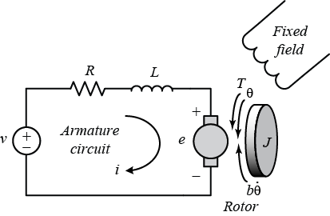
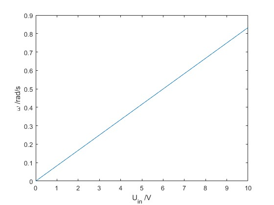
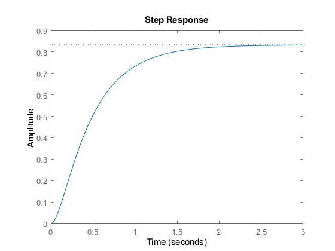
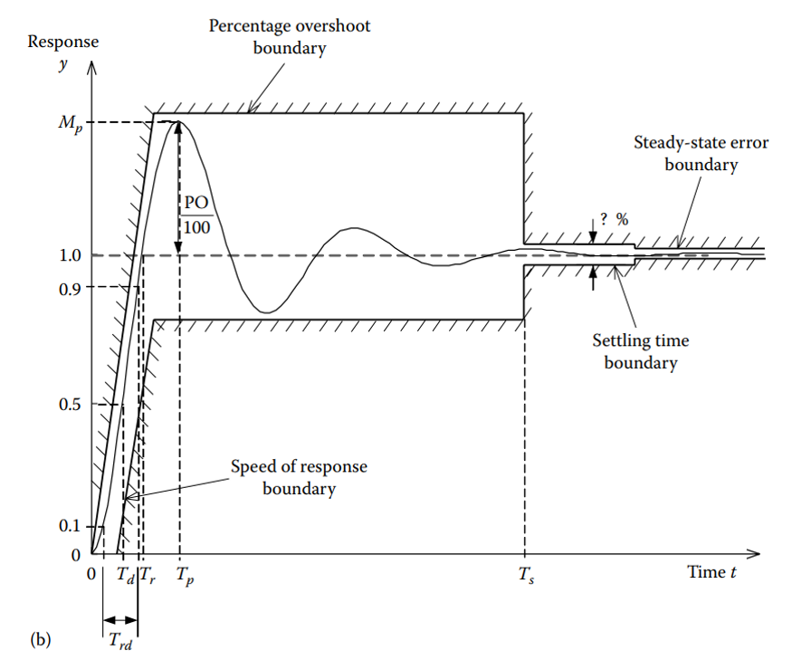

# Overview
{: .reading}

* This will become a table of contents (this text will be scrapped).
{:toc}

# Modellierung der Übertragungsfunktion eines DC-Motors

## Einleitung

Ein Gleichstrommotor (DC-Motor) kann durch eine Differentialgleichung beschrieben werden, die die mechanischen und elektrischen Eigenschaften des Motors berücksichtigt. In dieser Lesson werden wir die Übertragungsfunktion eines DC-Motors herleiten, die das Verhalten der Drehzahl als Antwort auf eine angelegte Spannung beschreibt. Dies ist gültig für einen "Armature Controlled" DC-Motor, daher es wird ein fixes Magnetfeld angelegt und der Rotorspulenstrom verändert.

## 1. Physikalisches Modell

Die Dynamik eines DC-Motors lässt sich durch zwei grundlegende Gleichungen beschreiben:
- Die elektrische Gleichung, die das Verhalten des Ankers beschreibt.
- Die mechanische Gleichung, die das Drehmoment und die Rotationsbewegung beschreibt.

  

### 1.1 Elektrische Gleichung

Auf Basis des obigen Bildes finden wir die elektrische Gleichung des DC Motors. Wir bilden eine Schleife im Uhrzeigersinn. Wobei der Spannungsabfall der Induktivität von der zeitlichen Veränderung des Stromes abhängig ist und der Spannungsabfall über den Wiederstand vom absoluten Wert des Stromes. Die elektrische Gleichung des DC-Motors lautet:

\\[
V(t) = L \frac{dI(t)}{dt} + R I(t) + e(t)
\\]

wobei:
- $$V(t)$$: angelegte Spannung [V]
- $$L$$: Induktivität der Ankerspule [H]
- $$R$$: Widerstand der Ankerspule [Ω]
- $$I(t)$$: Ankerstrom [A]
- $$e(t) = K_e \omega(t)$$: Gegen-EMK (elektromotorische Kraft) [V]
- $$K_e$$: EMK-Konstante [V/(rad/s)]
- $$\omega(t)$$: Winkelgeschwindigkeit des Motors [rad/s]

### 1.2 Mechanische Gleichung

Für die mechanische Gleichung betrachten wir die rechte Seite des Bildes. Wir bilden ein Momentengleichgewicht an der Achse des Motors. Wir berücksichtigen die Trägheit des Rotors, die Reibung in den Lagern und das vom Motor erzeugte Ausgangsmoment. Die mechanische Gleichung des DC-Motors lautet dann:

$$
J \frac{d\omega(t)}{dt} + B \omega(t) = K_m I(t)
$$


wobei:
- $$J$$: Trägheitsmoment des Motors [kg·m²]
- $$B$$: Viskoser Reibungskoeffizient [N·m·s/rad]
- $$K_m$$: Motorkonstante [N·m/A]

### Annahmen

- Der Motor ist unbelastet, daher ist das Lastmoment $$T_L \approx 0$$.
- Es wird ein linearisiertes Modell betrachtet.

## 2. Übertragungsfunktion herleiten

Ziel ist es, eine Übertragungsfunktion der Form $$\frac{\Omega(s)}{V(s)}$$ zu finden, wobei $$\Omega(s)$$ die Laplace-Transformierte der Winkelgeschwindigkeit und $$V(s)$$ die Laplace-Transformierte der angelegten Spannung ist. Daher versuchen wir die mechanische und die elektrische Gleichung zu kombinieren.

### 2.1 Laplace-Transformation

Durch Anwenden der Laplace-Transformation auf die Differentialgleichungen (mit Anfangsbedingungen gleich null) erhalten wir:

1. Elektrische Gleichung: Es wird $$t$$ durch $$s$$ ersetzt und $$\frac{dI(t)}{dt}$$ wird zu $$sI(s)$$.
   
$$
V(s) = (L s + R) I(s) + K_e \Omega(s)
$$

3. Mechanische Gleichung:

$$
J s \Omega(s) + B \Omega(s) = K_m I(s)
$$

### 2.2 Ankerstrom $$I(s)$$ eliminieren

Um die Übertragungsfunktion zu finden, eliminieren wir $$I(s)$$ zwischen den beiden Gleichungen:

Aus der elektrischen Gleichung:

$$
I(s) = \frac{V(s) - K_e \Omega(s)}{L s + R}
$$

Durch einsetzen in die mechanische Gleichung.

$$
J s \Omega(s) + B \Omega(s) = K_m \left( \frac{V(s) - K_e \Omega(s)}{L s + R} \right)
$$

### 2.3 Übertragungsfunktion formen


Umstellen der Gleichung ergibt:

$$
(J s + B) \Omega(s) (L s + R) = K_m V(s) - K_m K_e \Omega(s)
$$

Sortieren nach $$\Omega(s)$$ ergibt:

$$
\Omega(s) \left[ (J s + B)(L s + R) + K_m K_e \right] = K_m V(s)
$$

Die Übertragungsfunktion $$\frac{\Omega(s)}{V(s)}$$ ergibt sich zu:

$$
\frac{\Omega(s)}{V(s)} = \frac{K_m}{(J s + B)(L s + R) + K_m K_e}
$$

<!--
### 2.4 Vereinfachte Form

Wenn die Induktivität $$L$$ im Vergleich zu $$R$$ sehr klein ist ($$L \approx 0$$), kann die Gleichung vereinfacht werden:

$$
\frac{\Omega(s)}{V(s)} = \frac{K_m}{J R s^2 + (B R + K_m K_e) s}
$$
-->
Das vollständige System zeigt den Zusammenhang zwischen der Eingangsspannung $$V(s)$$ und der Ausgangsdrehzahl $$\Omega(s)$$.

## 3. Simulationsparameter

Hier sind typische Parameter, die zur Simulation eines DC-Motors verwendet werden könnten:

| Parameter | Wert | Einheit | Beschreibung |
|-----------|------|---------|--------------|
| $$R$$   | 1.2  | Ω       | Widerstand der Ankerspule |
| $$L$$   | 0.5 | H       | Induktivität der Ankerspule |
| $$K_e$$ | 0.01 | V/(rad/s) | EMK-Konstante |
| $$K_m$$ | 0.01 | N·m/A   | Motorkonstante |
| $$J$$   | 0.01 | kg·m²   | Trägheitsmoment |
| $$B$$   | 0.1  | N·m·s/rad | Viskoser Reibungskoeffizient |

###  Stationäres System
Stationär bedeutet in diesem Zusammenhang, dass sich weder die Eingangsspannung noch das Lastmoment ändert. Das Heißt der Wert von $$s = 0$$, da dieser mit der Frequenz und der Dämpfung zusammenhängt. Die Eingangsspannungs zu Drehzahlkurve kann z.B. in MatLab folgendermaßen geplottet werden. Im realen Fall gäbe es allerdings eine Minimalspannung (ab der sich etwas bewegt) und Maximalspannung (aber welcher der Motor zerstört wird.

````MATLAB
U_in = 0:0.1:10; % Zum Beispiel bis 10 V
Omega = U_in*(0.01/(1.2*0.1+0.01*0.01)); % In Transferfuction eingesetzt mit s = 0 und auf Omega umgeformt.
plot(U_in, Omega)
xlabel("U_{in} /V")
ylabel("\omega /rad/s")
````



### Dynamisches System
Dynamische können wir das System z.B. mithilfe einer Step Response Analysieren. Wird in Matlab ein Transferfunction Objekt erstellt, können dafür bereitgestellte Funktionen wie `step()` verwendet werden. Code und Ergebnis sieht folgendermaßen aus:


````MATLAB
T = tf(0.01, [(0.01*0.5) (0.01*1.2 + 0.1*0.5) (1.2*0.1+0.01*0.01)]) % Aus der transferfunction. Format: tf(Zähler, [a b c]) wenn as^2 + bs + c
opt = stepDataOptions;
opt.StepAmplitude = 10; % 10 V Input anstatt unit step
step(T, opt)

````



Man erkennt, dass bei 10 V Input sich der Motor dem stationären Fall bei 10 V annähert. Allerdings werden noch Informationen die Zeitabhängig sind erkennbar. Aus einem der Foliensätze zu den Parametern bestimmter Systeme bekommt man noch einmal einen Überblick was man nun aus einer Step Response herauslesen kann.



.
