# Overview
{: .reading}

* This will become a table of contents (this text will be scrapped).
{:toc}

# Aufgabenstellung

Für diese Lehrveranstaltung werdet ihr eine Presentation vorbereiten und halten. Der Inhalt dreht sich dabei um ein spezifisches Wearable, welche dabei zur Option stehen wird von den Lehrenden angegeben. Teile der Presentation könnt ihr bereits in der Vorlesung vorbereiten. Die Benotung erfolgt dabei wie folgt:
- 50% sind der Gesamteindruck der Presentation
    - Wie gut ist die Presentation Strukturiert?
    - Sind die Inhalte gut aufeinander abgestimmt?
- 50% sind der Endruck der einzelnen Personen und Teilinhalte
    - Wie gut sind die spezifischen Teile vorbereitet und vorgetragen?

So soll die Gruppe aber auch jeder einzelne in der Benotung berücksichtigt werden. Die Grundstruktur der Presentation ist vorgegeben. Jedes Teilthema wird von jeweils einer Person vorbereitet. Es gibt 4 Teilthemen -> es werden somit **Gruppen von 4** gebildet.

> Es bleibt eine Gruppe von 3 übrig. Diese wird den Inhalt etwas reduzieren können. Wie genau wird dann zwischen der Gruppe und den Lehrenden geklärt.

# Bildet Gruppen und wählt ein Thema

Im ersten Schritt ist ein Thema auszuwählen. Bildet Gruppen von 4, lest euch die Themen durch und wählt ein geeignetes aus folgender Liste aus:
- [Kraftmesssohle](https://ethz.ch/en/news-and-events/eth-news/news/2023/03/3d-printed-insoles-measure-sole-pressure-directly-in-the-shoe.html){:target="_blank"}
- [Parkinson Schuhsohle](https://www.helpsole.com/){:target="_blank"}
- [Messshirt](https://ethz.ch/en/news-and-events/eth-news/news/2023/03/detecting-exhaustion-with-smart-sportswear.html?utm_source=facebook&utm_medium=ETH+Z%C3%BCrich&utm_content=c69a0ce196964729a851b8cce89e1509-768635709814450&utm_campaign=HK_Grund_Forschung&fbclid=IwAR0gZSPZ6_jSP7h5UIdf1tzqGVPmU2vYh29cguyW7C68IVuP5fLspcPle8g){:target="_blank"}
<!-- - [Bluddruckmanschette mit Radarsensor](https://www.blumio.com/){:target="_blank"} -->
- [Temperaturmessung mit Pflaster](https://www.steadysense.at/){:target="_blank"}
- [Blutdruckmessung am Armgelenk](https://www.omron-healthcare.de/de/blutdruckmessgeraete/heartguide.html#prefn1=device_type&prefv1=Tragbares%20Blutdruckmessger%C3%A4t&start=1){:target="_blank"}
- [Wearable EKG](https://www.zephyranywhere.com/system){:target="_blank"}

Wenn ihr euer Thema gefunden habt, schreibt eine Mail an die Lektoren mit dem Thema und allen Gruppenmitgliedern. Gebt außerdem ein Backup-Thema an welches zum Zug kommt, falls zwei Gruppen das gleiche Thema auswählen.
> Würden alle 4 Gruppen die selben Themen angeben werden die Lektoren die Themen zufällig verteilen.

Manche der Themen sind kein "vollständiges" Wearable bzw. fertiges Produkt. In der Presentation kann hier z.B. hypothetisch Diskutiert werden wie denn ein Produkt aussehen könnte und welche Teile zum derzeitigen Zeitpunkt noch fehlen.

# Strukturiert eure Presentation

Im nächsten Schritt werdet ihr die Teilthemen eurer Präsentation zuteilen. Die Teilthemen sind:

- **Intro**: Das Gerät wird vorgestellt. Welches Problem löst es? Warum Qualifiert es sich als Wearable bzw. was ist noch nötig damit es sich als Wearable qualifiziert?
- **Funktionsweise**: Beschreibe die technischen Hintergründe des Wearable. Such dir dabei ein bestimmtes Feature heraus auf das technisch im Detail eingegangen werden soll. 
- **Anwendung**: Beschreibe die Anwendung bzw. mögliche Anwendungen für das Wearable. Gehe dabei auf die User-Gruppe und Stakeholder ein.
- **Ethische Aspekte und Diskussion**: Diskutiere ethische Aspekte die mit dem Wearable einher gehen. Dies wird das Ende der Presentation sein und der Starpunkt für eine Diskussion.
- **Quiz**: Verpflichtender Teil der Präsentation wird ein kurzes Quiz (3-4 Fragen) sein. Verwendet dazu ein passendes Tool (e.g. [Slido](https://www.slido.com/de){:target="_blank"}) welches ihr in eure Folien einbinden und Fragen an euer Publikum stellen könnt.
  
Jeder in der Gruppe übernimmt eines der Teilthemen und wird dieses auch vorstellen. Versucht es nach euren eigenen Interessen zu verteilen. In der Präsentation muss ersichtlich sein wer welches Thema vorgetragen hat, damit eine Einzelnote vergeben werden kann. Die Reihenfolge der Themen wird wie angegeben empfohlen, kann aber angepasst werden.


# Bereitet die Presentation inhaltlich vor

Die Teilthemen sollten von der jeweiligen Einzelperson vorbereitet werden, es sollte sich jedoch die Gruppe natürlich gegenseitig dabei unterstützen. Bevor dazu jeder in sein eigenes Thema eintaucht, wird empfohlen einen ersteimal den Inhalt der Gesamten Präsentation gegenseitig abzustimmen.

Der Inhalt der Teilthemen ist bereits oben kurz umrissen. Er sollte so gut es geht mit den Inhalten aus der Vorlesung verknüpft werden. So ist es natürlich kein Zufall, dass die Struktur der Präsentation ähnlich zu denen der Vorlesung sein wird.


<!-- Bilder und kurze Zusammenfassung von Inhalten? An einem Beispiel aus der VO? -->

# Abgabe und Ablauf

Der erste Teil der Abgabe beginnt damit, dass ihr die fertige Powerpoint-Presentation einen Tag vor dem letzten Termin beim zugehörigen Sakai-Assignment hochladet. Die Präsentation werden wie kurz in der Vorlesung erwähnt am letzten Termin in einer art Mini-Konferenz vorgetragen und werden sich bereits vorbereitet am PC befinden.

> Es darf auch davor jederzeit die Presentation geschickt werden, falls jemand Feedback möchte.

Die Presentation sollte 20 min betragen, jede Person sollte ca. 5 min. sprechen. Anschließen sind 10 min für die Diskussion und den Gruppenwechsel eingeplant. Wird die Zeit stark über- bzw. unterschritten gibt es Punkeabzug. Es wird eine Pause von 15 min. als Puffer geben. Die Noten werden gesondert über das Office in den darauffolgenden Tagen bekannt gegeben.


<!-- {: .reading}

The User Interface (UI) or Graphical User Interface (GUI) is arguably the most important part of a program. True, functionality is crucial too, but all the functions of non-trivial programs are hidden behind the UI. If the UI is poorly designed, users tend to look for alternatives.

In this session, we will have a look at the tools available to design a basic UI. As an example, we will create an activity that shows a simple **contact form** where the user can input personal details and a message:

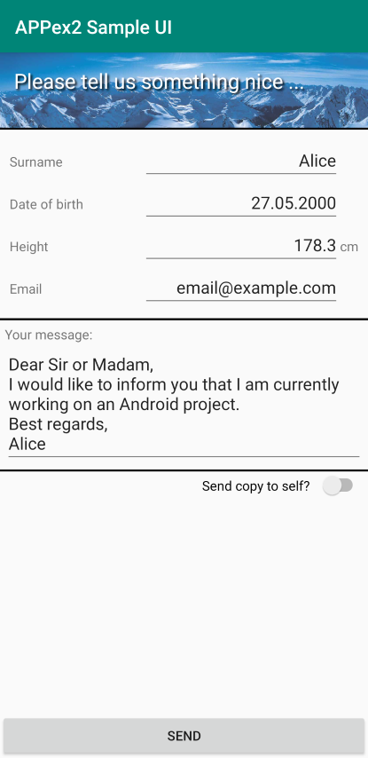

In this example, we will use different **Widgets**

- [TextView](https://developer.android.com/reference/android/widget/TextView){:target="_blank"}
- [EditText](https://developer.android.com/reference/android/widget/EditText){:target="_blank"}
- [ImageView](https://developer.android.com/reference/android/widget/ImageView){:target="_blank"}
- [Switch](https://developer.android.com/reference/android/widget/Switch){:target="_blank"}
- [Button](https://developer.android.com/guide/topics/ui/controls/button){:target="_blank"}

and **Layouts**

- [ConstraintLayout](https://developer.android.com/reference/androidx/constraintlayout/widget/ConstraintLayout){:target="_blank"}
- [LinearLayout](https://developer.android.com/guide/topics/ui/layout/linear){:target="_blank"}
- [TableLayout](https://developer.android.com/reference/android/widget/TableLayout){:target="_blank"}

as well as some layout elements to build the user interface according to the picture.

# AndroidStudio Layout Editor
*AndroidStudio* includes a powerful [**layout editor**](https://developer.android.com/studio/write/layout-editor){:target="_blank"} that makes building a functional UI relatively easy. However, as is common with powerful tools, there is a **learning curve** involved. Due to the wide array of possibilities to design the interface, it may be hard to find your way around the editor in the beginning.

The Layout Editor appears when you open an XML layout file.

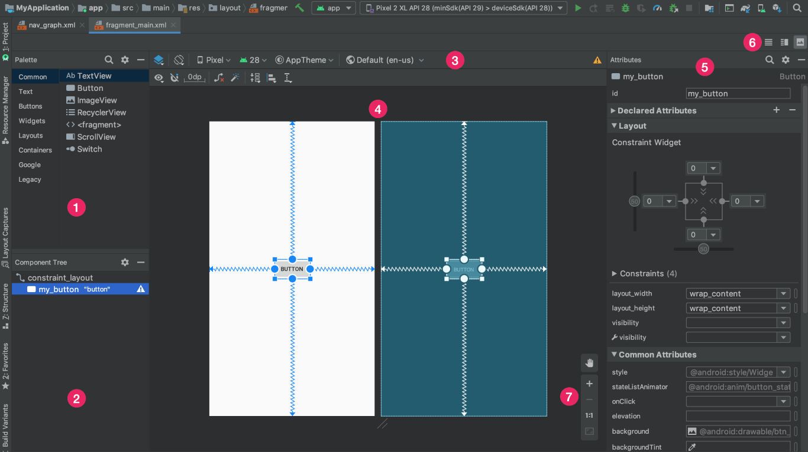

1. **Palette**: Contains various views and view groups that you can drag into your layout.
2. **Component Tree**: Shows the hierarchy of components in your layout.
3. **Toolbar**: Click these buttons to configure your layout appearance in the editor and change layout attributes.
4. **Design editor**: Edit your layout in Design view, Blueprint view, or both.
5. **Attributes**: Controls for the selected view's attributes.
6. **View mode**: View your layout in either Code code mode icon, Design design mode icon, or Split split mode icon modes. Split mode shows both the Code and Design windows at the same time.
7. **Zoom and pan controls**: Control the preview size and position within the editor.

## Design View and Code View
The layout editor enables us to design the UI by dragging **widgets** like a *TextView* onto the screen and adjusting its attributes with a live preview. This is called the **design view**.

The **actual layout code** can be seen when switching to **code view**. There we see the XML code that the layout is based upon.

````xml
<?xml version="1.0" encoding="utf-8"?>
<LinearLayout xmlns:android="http://schemas.android.com/apk/res/android"
    xmlns:app="http://schemas.android.com/apk/res-auto"
    xmlns:tools="http://schemas.android.com/tools"
    android:layout_width="match_parent"
    android:layout_height="match_parent"
    android:orientation="vertical">

    <androidx.constraintlayout.widget.ConstraintLayout
        android:layout_width="match_parent"
        android:layout_height="80dp">

        <ImageView
            android:id="@+id/imageView"
            android:layout_width="match_parent"

...
````

The actual layout is **only** defined in code in the XML. The design that we see in design mode is just a representation. When we change something in design mode, the actual change is done in the code and the design is updated accordingly. Very complex designs are done in code, rather than using the design view. However, in this course we will only seldom find a reason to design directly via code view.

# Workshop: Contact Form Activity
{: .reading}

Let's start by creating a new AndroidStudio project using the "Empty Activity" template.

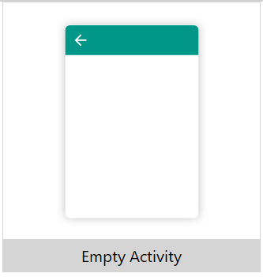

This template creates a first activity with a simple UI. Select "app/res/layouts/activity_main.xml" in the project tree:

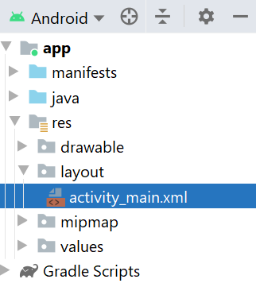

This opens the layout editor and shows an UI that consists of a ``ConstraintLayout`` that fills the whole screen and a ``TextView`` with the text "Hello World!" written in the center of the screen:

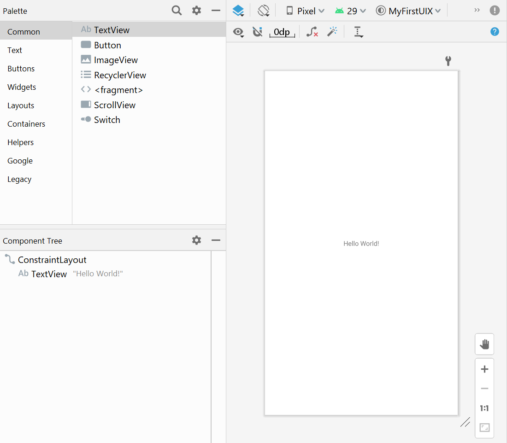

If we have a look at the code view, we see the according XML:

````xml
<?xml version="1.0" encoding="utf-8"?>
<androidx.constraintlayout.widget.ConstraintLayout xmlns:android="http://schemas.android.com/apk/res/android"
    xmlns:app="http://schemas.android.com/apk/res-auto"
    xmlns:tools="http://schemas.android.com/tools"
    android:layout_width="match_parent"
    android:layout_height="match_parent"
    tools:context=".MainActivity">

    <TextView
        android:layout_width="wrap_content"
        android:layout_height="wrap_content"
        android:text="Hello World!"
        app:layout_constraintBottom_toBottomOf="parent"
        app:layout_constraintLeft_toLeftOf="parent"
        app:layout_constraintRight_toRightOf="parent"
        app:layout_constraintTop_toTopOf="parent" />

</androidx.constraintlayout.widget.ConstraintLayout>
````

## 'root' Layout
The uppermost layout that is shown in the component tree is called the **root layout**. By default, this is of the type ``ConstraintLayout`` and you should leave it this that way if you don't have compelling reasons to change it. The ``ConstraintLayout`` is one of the most flexible layouts and therefore well suited as the root layout.

## 'TextView' Widget
One of the most basic widgets that is available in the **Palette** is the ``TextView`` to display some text. Some important **attributes** are

- **id**: The *unique* id of the widget
- **text**: The text that is displayed
- **textSize**: The size of the text
- **textStyle**: Normal/bold/italic text style
- **style**: Predefined text style like *header*, *label*, ...
- **textColor**: The font color

**Play around with different attributes to notice their effect.**

>Afterwards, delete the ``TextView`` that displays the "Hello World!" message to continue.

# Creating the Basic Layout Structure
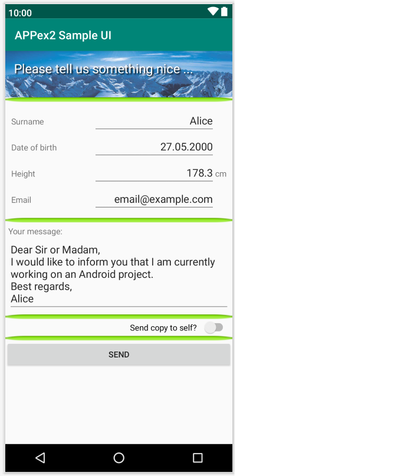

When looking at the proposed UI, you should notice the basic layout has a **row-like structure**. There is a header including a background image, a section to input personal information, a row for the message and so on.

The easiest way to build such a structure is using a ``LinearLayout (vertical)``. This layout creates sections that behave like a list of rows. Exactly what we want in this case.

> Drag and drop a ``LinearLayout (Vertical)`` from the Palette (Section: Layouts) onto the root layout.

Beware that the `LinearLayout (Vertical)` is a direct child of the `ConstraintLayout`:

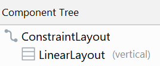

When you select the ``LinearLayout`` in the component tree, you will notice red exclamation marks in the layout section of the attributes, telling you that it is
- Not horizontally constrained
- Not vertically constrained
  
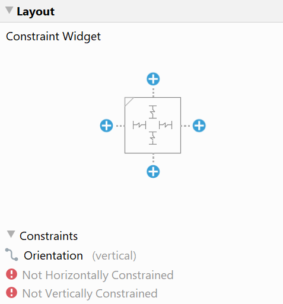

Any child of ``ConstraintLayout`` needs to have horizontal and vertical constraints defined, hence the name. In our case, we want the ``LinearLayout`` to fill the entire activity screen. So we define constraints such that

- the **left edge** of the ``LinearLayout`` has *0 offset* from the **parent's left edge** (``ConstraintLayout``)
- the **top** of the ``LinearLayout`` has *0 offset* from the **parent's top**
- the **right edge** of the ``LinearLayout`` has *0 offset* from the **parent's right edge**
- the **bottom** of the ``LinearLayout`` has *0 offset* from the **parent's bottom**


> Click on the blue ``+`` signs to create constraints, leaving the default value of ``0``. In our case, this adds the attributes

- ``layout_constraintBottom_toBottomOf="parent"``
- ``layout_constraintTop_toTopOf="parent"``
- ``layout_constraintStart_toStartOf="parent"``
- ``layout_constraintEnd_toEndOf="parent"``

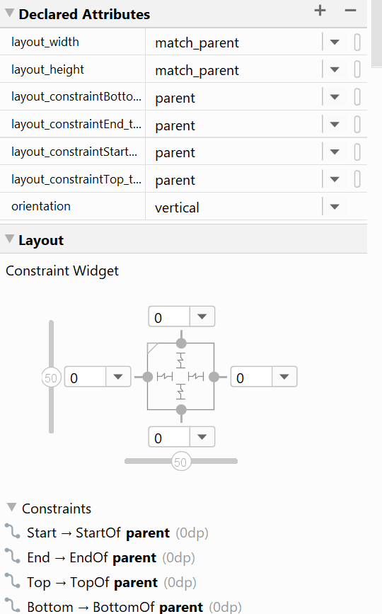

When you read the created attributes' names carefully, you should notice that you can read the constraints they represent like an english sentence:

>``layout_constraintBottom_toBottomOf="parent"``:
>*Constrain the bottom of [this layout] to the bottom of the parent, with 0 offset*.

In fact, we made the ``LinearLayout`` take up the same screen space as its parent, the ``ConstraintLayout``.

**If you break your layout at any point, feel free to copy the code of the linked activity_main.xml in each step into your own code view:**

[>Layout Code for this step<](../../assets/source/003_ui/01_activity_main.xml){:target="_blank"}

## Image Header
Let's fill our layout with life and create a simple image header. In the picture of the final layout, we see that the header consists of an image with some text printed on top of it.

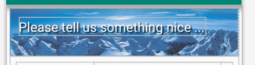

If we have a look at the **Blueprint view**, we see the structure even clearer.

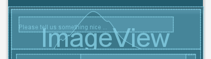

> Drag and drop following widgets from the palette to your component tree:
> - ``ConstraintLayout`` as **child** of our LinearLayout
> - ``ImageView`` as **first child** of the new ConstraintLayout (choose the image "backgrounds/scenic" for now, when asked)
> - ``TextView`` as **second child** of the new ConstraintLayout

At this point, your component tree should look like this:

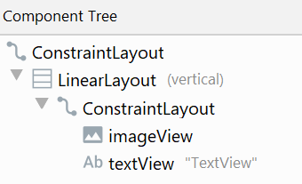

### Styling the Image Header

Right now, the header takes up the whole screen. The reason for this is, that the ``ConstraintLayout`` that is a child of the ``LinearLayout`` has the attribute ``layout_height`` set to ``match_parent``, i.e. it has the same height as ``LinearLayout``, which is the whole screen.

> Change the ``layout_height`` to ``80dp``

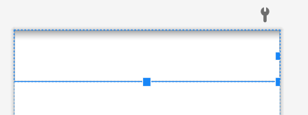

Next, let's have a look at the ``TextView`` and ``ImageView``. their layout attributes are also way off, right now they are located down beneath the bottom of the screen. However, you may have noticed that both have the red exclamation marks shown next to them, meaning that they are still unconstrained. Let's change that now:

> Select ``TextView``
> 
> Set the attribute ``layout_height`` to ``0dp`` (``0dp (match_constraint)`` when using the drop down menu)
> 
> Click on the blue ``+`` circles in the layout section of the attributes and fill in `0` as the offset on each side (like we did earlier)
>
> Repeat this for the ``ImageView``

The image header should now look like this:

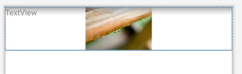

### ImageView
Now we see that the image does not fit the header. We need to change an attribute which controls how the image is scaled inside the available space.

> Select the `ImageView` in the component tree
> 
> Change the attribute `scaleType` to `centerCrop`

> **Hint**: To easily find attributes in the list, you can use the search function by clicking on the magnifying glass icon
> 
> 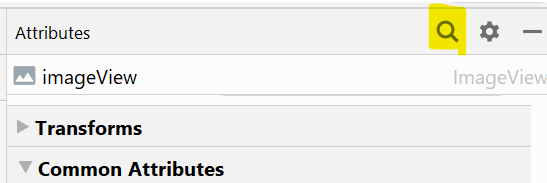

### TextView
Now let's style the text inside the image to something that looks halfway decent.

> Select the `TextView` in the component tree
>
> Change the attributes:
> - ``text``: `Contact us...`
> - ``textSize``: `30sp`
> - ``layout_height``: `wrap_content`
> - ``textColor``: Select `white`
> - ``paddingStart``: ``30dp`` (expand the attribute ``padding`` to see this)

Notice the changes each attribute has on the layout. The values provided are just for reference, **feel free to adjust them to your liking**. In the end, it will look similar to this:

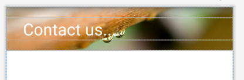

[>Layout Code for this step<](../../assets/source/003_ui/02_activity_main.xml){:target="_blank"}

# Personal Details Input
The next section to work on is where the users should input their personal details. It consists of multiple rows of text labels and input fields. The final version could look something like this:

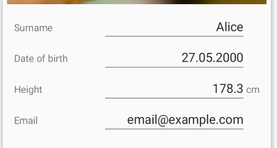

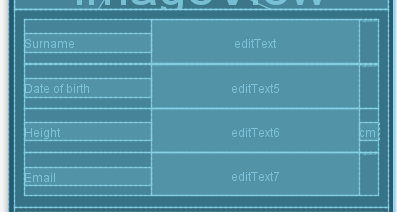

The Blueprint view of this section shows, that the structure resembles a table, so we will use a ``TableLayout``.

> Start by adding a ``TableLayout`` from the palette into your component tree. It should be the last child of the ``LinearLayout``.
>
> Next, add 4 ``TableRow`` as children of ``TableLayout``.

The resulting component tree will look like this:

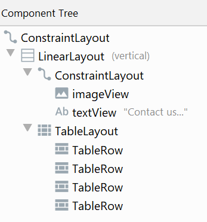

Now that we have the rows of the table in place, let's place the widgets. The ``TableLayout`` will assign each widget that is a **direct child** of a ``TableRow`` its own column. So if we add 3 direct children to a ``TableRow``, the resulting table will have 3 columns.

Some of our rows have 2 columns, while the "Height" input row has **one extra column**. We have to be careful to add **the same number of child widgets** to each row. So when we want to have an empty space somewhere, we add a `Space` (Palette: Layouts) widget instead.

> Keep adding widgets into your layout according so that it corresponds to the following table:

|        | Column1      |      Column2  |      Column3 |
|--------|:-------------|:---------------|:-------------|
|**Row1**| ``TextView`` | ``EditText`` (Plain Text) | ``Space``    |
|**Row2**| ``TextView`` | ``EditText`` (Date) | ``Space``    |
|**Row3**| ``TextView`` | ``EditText`` (Number(Decimal)) | ``TextView`` |
|**Row4**| ``TextView`` | ``EditText`` (Email) | ``Space``    |


Notice that ``EditText`` takes many specialized forms that differ in the type of text that a user can enter into it, as well as the type of keyboard that is shown to the user. You can find all the available forms in the palette in the "Text" section.

Your component tree should now look similar to this:

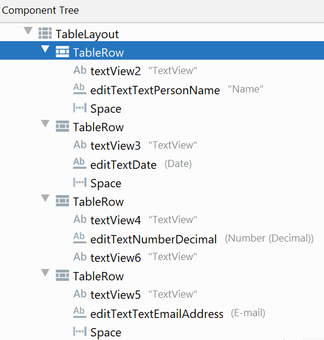

## Widget IDs

Before the current input section, we only added layouts and static content (the header), so we did not care about the specific IDs that the widgets had. Now this is different, as we added input fields which at a later point we have to access from our Java code to save or send their values.

It is convenient to adhere to a common naming scheme for your widgets. When you work with the widgets in the code, you only have the variable name to guess what kind of widget a variable holds. Therefore, it is common to add the type as a prefix to the name: `prefixName`

Examples:
- `txtName`: ID of a text input field that is supposed to hold a name.
- ``btnSend``: ID of a button that performs a send operation.

As a suggestion, you can use following prefixes for the most common types:
- `lbl`: For labels (`TextView`)
- `txt`: For text input fields (`EditText`)
- `btn`: For buttons (`Button`)
- `chk`: For checkboxes (`CheckBox`)
- `tb` : For toolbars (`ToolBar`)

For other types you can use the type itself as the prefix:
- `switch` for switches (``Switch``)
- `map` for maps (``MapView``)

> Assign a sensible attribute `id` to each widget in the `TableRow`s (except the spaces).
> 
> Be careful, IDs have to be **unique**.

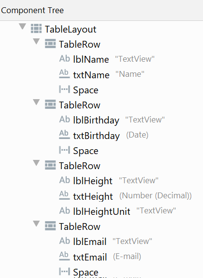

## Styling
Our details input section still does not look good, so let's get to work.

First of all, the ``TableLayout`` takes up all the extra screen space at the bottom. It's `layout_height` is set to `match_parent` by default.

> Change the attribute `layout_height` to `wrap_content`.

Also, let's change the text of the widgets.

> Change the `text` attribute of the labels accordingly.
>
> Add `text` to the input field so that it does not look so empty.

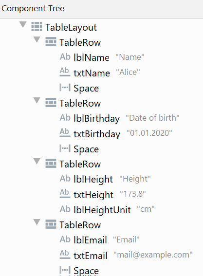

## Layout weight
For the label-input combinations to look nicer, let's add a layout weight.

A layout weight (`layout_weight`) makes widgets grow **if** there is extra space available. The whole extra space is then added to each widget on the same level where the attribute `layout_weight` is greater than 0.

The formula is:

``extra_widget_size = empty_space_available * (layout_weight / cumulative_layout_weight)``

Example:

Suppose there is ``60px`` empty space available in a row containing 3 widgets. ``widget1`` has a `layout_height` set to `2`, ``widget2`` has it set to `1` and ``widget3`` does not have the attribute `layout_height` declared at all.

In this case, ``widget1`` will get an extra ``40px`` (60\*2/3) while ``widget2`` can grow by ``20px`` (60\*1/3). ``widget3``'s size does not change.

Check the [official documentation](https://developer.android.com/guide/topics/ui/layout/linear){:target="_blank"} for details.

> Add the attribute `layout_weight` with a value of `1` to each widget in the first two columns.

## Result

At this point, your layout should look similar to this:

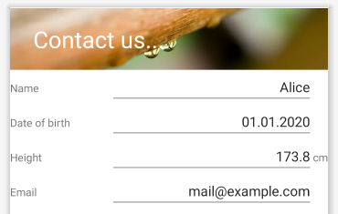

[>Layout Code for this step<](../../assets/source/003_ui/03_activity_main.xml){:target="_blank"}

# Message Input

The next section to work on is the message input. In the end it should look like this:


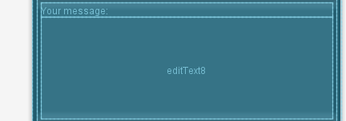

So in this section, which is in the **third row of the initial vertical** ``LinearLayout``, we want to have a small header and a larger message body in a vertical layout.

This should be easy, we only have to add things we already know.

> Add a `LinearLayout (vertical)` as the **third** child of the initial `LinearLayout`. Change the new layout's `id` attribute to `LinearLayoutMessage`.
>
> Change the `layout_height` of `LinearLayoutMessage` to `match_content`.
>
> Add a `TextView` and a `EditView` of variant "Multiline Text" as children of `LinearLayoutMessage`.
> Choose sensible `id`s and fill the `text` attributes so that there is appropriate content. *Hint: use `\n` to include a new line in the text*

Afterwards, your component tree will look like this

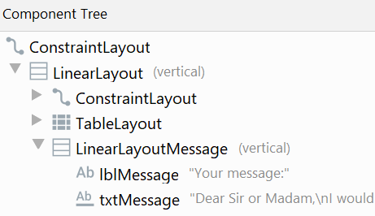

and the layout should look similar to

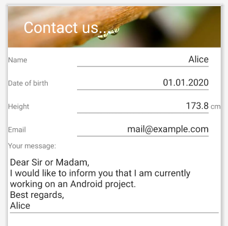

[>Layout Code for this step<](../../assets/source/003_ui/04_activity_main.xml){:target="_blank"}

# Email Options Section
In order to customize the user experience, we want to include a section where the user is able to select options. 

We will only need the one option to let the user choose to also send a copy of the contact form to his own email address once it is sent.

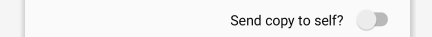


In order to achieve the button alignment on the right, we use a `LinearLayout (horizontal)` with a ``Space`` and a ``Switch``. Adding more option switches adds just more of the same, so we are content with just one.

> Add a `LinearLayout (horizontal)` as the **fourth** child of the initial `LinearLayout`. Change the new layout's `id` attribute to `LinearLayoutOption`.
>
> Change the `layout_height` of `LinearLayoutOption` to `match_content`.
>
> Add a `Space` and a `Switch` (Palette: Buttons) as children of `LinearLayoutOption`.
> Choose sensible `id`s and fill the `text` attribute of the `Switch` to make sense.

At this point it should be easy for you to align the switch to the right side. If not, have a look at the layout code at the end of this section. We get to the resulting component tree

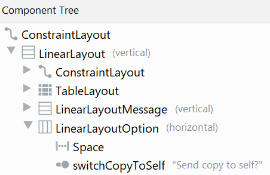

and the layout

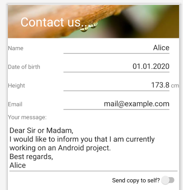

[>Layout Code for this step<](../../assets/source/003_ui/05_activity_main.xml){:target="_blank"}

# Send Button

The last section to do is to include a "Send"-Button. This is the fastest section, as we only need to add a `Button` widget.

> Add a `Button` (Palette: Buttons) as the **fifth** child of the initial ``LinearLayout``.
>
> Set attributes `id` and `text` to appropriate values.

You will then get a layout like this:

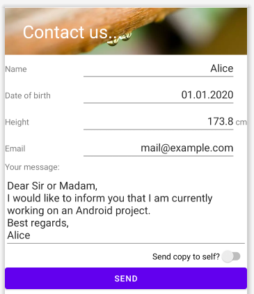

There is one optional step that we can add to force the "Send"-Button to always be at the bottom of the screen.

>**Try to do that on your own**

If you did it correctly, you will get to the resulting layout

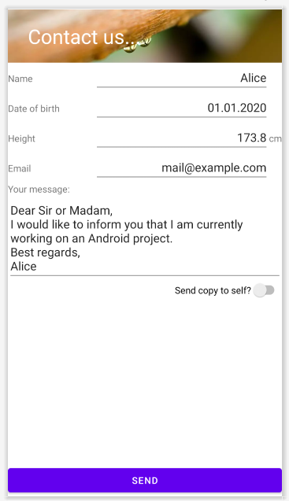

[>Solution and final layout code<](../../assets/source/003_ui/06_activity_main.xml){:target="_blank"}

>**Play around with this layout to gain a better understanding of the layout editor**. One starting point for your own adventures could be to change the `padding`, so that the widgets do not directly touch the edge of the screen. -->
