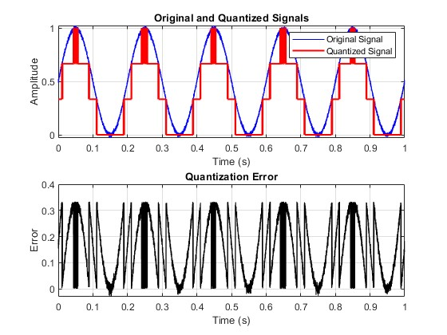

# Overview
{: .reading}

* This will become a table of contents (this text will be scrapped).
{:toc}

## Quantization

**Quantization** is the process of mapping continuous infinite values to a smaller set of discrete finite values.

> There are various methods for quantizing a signal. One can use the value 0 as a valid value, interpret the most significant bit (MSB) as a sign bit, or use two's complement representation.

**Quantization Error**: The error that occurs during quantization (the conversion of an analog signal into a digital signal). Since digital signals can only represent discrete values, a continuous analog signal is mapped to a digital value that is closest to the analog value. This mapping process results in an error, which is referred to as the quantization error.

## Task 1: Signal Creation

Create a script using the programming tool of your choice. Generate a discrete sinusoidal signal witht the following properties:
- Frequency of 5 Hz.
- Length of 1 s
- Amplitude of 1
Choose a sampling frequency that fits according to the Nyquist theorem. Additionally, add randmon noise to the signal. Start with a small standard deviation (e.g. 0.01). This representation would be close to the sampled but not yet quantized signal in a analog digital conversion.

## Task 2: Quantization

Write a function that quantizes a signal and takes the signal, a certain input range and the resolution in bit as input parameters. The output of the function should be the quantized signal, consisting only of the available quantized values similar to a usual ADC. Think about the properties of the flash ADC we discussed in the lecture. Which and how much levels are available? Is Zero included or not? Create plots that show the original signal, the quantized one and the quantization error. 
E.g. for a 2 bit quantization and small amounts of noise it should look as shown in the figure below:

## Task 3: Results and Conclusions

Play around with the script and try to answer the following questions:

- What happens with the quantization error with higher resolution?
- What is your maximum quantization error?
- What happens if you add a higher standard deviation of noise?
- What happens if you do not use the whole range available?

> If you are interested in the solution for the problem related to the last question, look up Analog Interface Amplifiers or Variable Gain Amplifiers.

---
