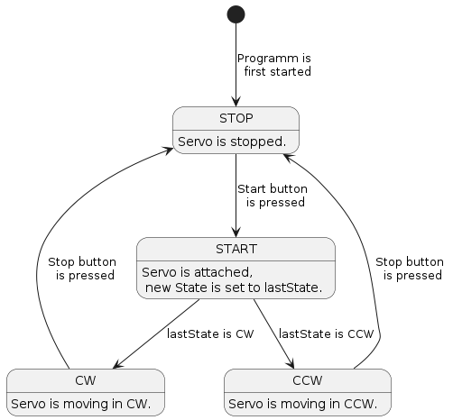

# Overview
{: .reading}

* This will become a table of contents (this text will be scrapped).
{:toc}

# Ansteuerung eines Servo Motors

## Einleitung

In diesem Projekt steuern wir einen Servo-Motor mit einem Arduino. Der Motor wird über zwei Buttons gesteuert: einer zum Starten und einer zum Stoppen der Bewegung. Wir werden mit der simpelsten Variante starten welche gewisse schwächen aufweist und versuchen den Code stetik zu verbessern.


## 1. Erstelle ein Wokwi Projekt

Erstelle ein Projekt auf Wokwi mit den folgenden Komponenten:
- Arduino (z.B. Arduino Uno)
- Servo-Motor
- 2 Taster (Buttons)

Die Verkabelung ist folgendermaßen:
1. **Servo-Motor**:  
   - Rotes Kabel → 5V (Vcc)  
   - Schwarzes/Braunes Kabel → GND  
   - Oranges/Weißes Kabel → PWM fähiger Arduino Pin (z.B. Pin 3)  

2. **Taster**:  
   - **Start-Taster**:  
     - Ein Pin des Tasters → Arduino Pin (z.B. Pin 4)   
     - Anderer Pin → GND  
   - **Stop-Taster**:  
     - Ein Pin des Tasters → Arduino Pin (z.B. Pin 2)   
     - Anderer Pin → GND 


## Erste Version

Die erste Version ist mehr oder weniger 1:1 die Version die uns auch ChatGPT und die meisten Online-Tutorials ausspucken würden. Ihr könnt diese natürlich von dort beziehen oder selbst schreiben:
- Binde die ``#include <Servo.h>`` in den Code ein.
- Definiere die Pins des Servos sowie der Buttons gleich wie verkabelt, z.B.: ``#define SERVO_PIN 3``.
- Schreibe zwei integer Variable für den Start und Stopwinkel des Servos.
- Im ``void setup()`` brauchen wir folgenden code:

````C++
void setup() {
  // Initialize the servo
  myServo.attach(SERVO_PIN);
  myServo.write(servoStartAngle); // Set servo to starting position
  
  // Initialize button pins
  pinMode(START_PIN, INPUT_PULLUP);
  pinMode(STOP_PIN, INPUT_PULLUP);

  // Starts the serial communication with baudrate of 9600
  Serial.begin(9600);
}
````
Der Loop beinhaltet nun die Ansteuerungslogik. In der ersten Version werden ``for`` loops genutzt um eine bewegung von 0-180-0 durchzuführen. Über die Länger der ``delay`` kann außerdem die Geschwindigkeit angepasst werden. Außerdem wird über die zwei Buttons gestartet und gestoppt indem die Funktion ``digitalRead`` den Status abfragt.

````C++
void loop() {
  // Read button states
  bool startButtonPressed = digitalRead(START_PIN); // Active LOW
  bool stopButtonPressed = digitalRead(STOP_PIN);   // Active LOW

  if (startButtonPressed  == LOW ) {
    servoRunning = true;
    Serial.println("Servo started.");
  }
  
  if (stopButtonPressed  == LOW ) {
    servoRunning = false;
    Serial.println("Servo stopped.");
  }

  // Control servo based on state
  if (servoRunning) {
    // Sweep servo back and forth
    for (int angle = servoStartAngle; angle <= servoStopAngle; angle++) {
      myServo.write(angle);
      delay(15); // Adjust for smooth movement
    }
    for (int angle = servoStopAngle; angle >= servoStartAngle; angle--) {
      myServo.write(angle);
      delay(15); // Adjust for smooth movement
    }
  } else {
    myServo.write(servoStartAngle); // Return servo to the start position
  }
}
````

Führe den Code aus und starte bzw. stoppe den Motor. Welche Probleme treten auf und warum? **Beantworte dazu Frage 1.**

## Zweite Version

Die zweite Version baut auf der ersten Version des codes auf. Allerdings nutzt sie einen sogennanten Interupt, damit der Motor jederzeit gestoppt werden kann. 
> Wie Interrupts genau funktionieren ist nicht Teil dieser Vorlesung. Wer einen genaueren Blick haben möchte findet hier eine gute erklärung LINK

Damit der Interrupt für den Stop Button funktioniert muss er mit einem Interuptfähigen Pin (z.B.: 2) des Arduino verkabelt sein. Im ``setup`` braucht es folgende Zeile Code um unseren Interrupt zu konfigurieren. Dabei legen wir den Pin fest und die Funktion die im Falle einer fallenden Flanke am Pin ausgeführt werden soll.
````C++
attachInterrupt(digitalPinToInterrupt(STOP_PIN), stopServoISR, FALLING);
````
Im ``loop`` brauchen wir die Zeile die den Stop Button ausliest nicht mehr und kann gelöscht oder auskommentiert werden. Was uns noch fehlt ist die ``stopServoISR``. Erstelle eine Funktion ohne Rückgabe und Übergabeparameter mit dem selben Namen **außerhalb** des Programmblocks des ``loop``. In der Funktion soll die Variable ``servoRunning`` auf ``false`` gesetzt werden.

Führe den Code erneut aus. Welches Verhalten hat sich verbessert? Welches wahrscheinlich unerwünschte Verhalten zeigt sich nun besonders wenn der Servo gestoppt und erneut gestartet wird? **Beantworte dazu Frage 2.**

## Dritte Version

  


In der dritten Version implementieren wir eine State Machine um das Verhalten des Servo motors zu controllieren. Es kann wiederum der Code von vorhin als basis genommen werden, allerdings kommt diesmal einiges hinzu. Als erstes legen wir die States fest. Welche und wie viele ist an sich relativ frei wählbar. Meiner Meinung nach sinn machen würde:
- Ein State wenn der Motor Startet
- Ein State während er sich im Uhrzeigersinn bewegt
- Ein State während er sich gegen den Uhrzeigersinn bewegt
- Ein State wenn der Motor gestoppt wurde.

Wir scheiben die States und legen den ersten ``servoState`` sowie ``lastState`` fest. In C++ können wir dazu zum Beispiel ``enum`´ verwenden:

````C++
enum servoState {
  START,
  CW,
  CCW,
  STOP
};
servoState servoState = STOP;
int lastState = CW;
````

Die State Machine an sich implementieren wir als `switch-case`, wobei jeder case einen State einnehmen wird. Die nächste große verbessung zu den Codes davor kommt indem wir die `for` loops loswerden und gegen Timing mit Hilfe von `millis()` ersetzen. Dies ist eine Funktion die die momentane Systemlaufzeit in Millisekunden ausgibt. Ähnlich wie in den Versionen 1 und 2 kann so die Ansterungsperiode des Servos angepasst werden, indem damit der Zeitraum seit dem letzten Impuls gemessen wird. Erstelle dazu die Variable `int period_servo = 15;`,`unsigned long oldMillis = 0;` und `unsigned long absolutMillis = 0;` **Beantworte dazu Frage 3**.

Der Code unserer State Machine sieht dann folgendermaßen aus. Schau dir die States und Struktur an. **Implementiere den CCW State selbständig und rufe `stateMachineMotor()` an der passenden Stelle im Code auf.** passe den `loop()` entsprechend des neuen Programms an. **Führe den finalen Code aus und beantworte Frage 4.**

````C++
void stateMachineMotor() {

  switch (servoState) {
    case START:
      {
        myServo.attach(SERVO_PIN);
        unsigned long currentMillis = 0;
        Serial.println("Set State to lastState");
        servoState = lastState;
      }
      break;
    case CW:
      {
        unsigned long currentMillis = millis();
        lastState = CW;

        if (currentMillis - oldMillis > period_servo) {
          oldMillis = currentMillis;

          myServo.write(pos);


          if (pos >= servoStopAngle) {
            Serial.println("Set State to CCW");
            servoState = CCW;
          } else if (pos < servoStopAngle) {
            pos++;
          }
        }
      }
      break;
    case CCW:
      {
         // implementiere die CCW richtung selbst
      }
      break;
  
      case STOP:
      {
       Serial.println("SERVO IS STOPPED");
      }
  }
}


````


# Bonusaufgabe: Geschwindigkeitssteuerung mittels Potentiometer

Als Bonus kann noch ein Potentiometer hinzugefügt werden welches die Geschwindikeit des Servos in Echtzeit anpassen kann. Füge dazu eines zu deinem Projekt hinzu und verkabel es entsprechend mit einem der Analogen Eingängen. Lies den Analogen Eingang aus und manipuliere den Wert der `period_servo` im Bereich von 5 bis 60 Millisekunden.


