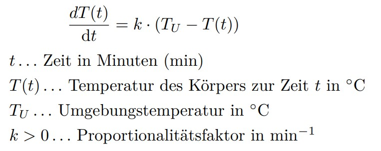

# Overview
{: .reading}

* This will become a table of contents (this text will be scrapped).
{:toc}


# Aufgabenstellung 

Nachdem wir unser erstes System erster Ordnung jetzt gemeinsam Modelliert haben, geht es jetzt darum unseren ersten Sensor zu modellieren. Ein Thermometer. In einem sehr einfachen Fall können wir hierzu das Newton'sche Abkühlungsgesetz heranziehen. 




1. Finde die Transer Function H(s), betrachte die Umgebungstemperatur als Input und die Temperatur des Körpers (= das Thermometer) als Output. Verwende dazu die Laplace Transformation um die Differentialgleichung als algebraische Gleichung zu lösen. Verwende gerne die Tabelle auf Sakai für das Lösen der Transformation selbst. 

2. Erstelle ein Bode Diagramm der Transfer Function für verschiedene Werte von k.

3. Multipliziere die Transfer Function mit einem Step Input Tu(s) = 1/s. Transformiere die Gleichung in den Zeitbereich indem du die inverse Laplacetransformation anwendest (wieder ggf. mit Tabelle)
4. Plotte die resultierende Funktion.


# Tipps

Ihr könnt als Tools verwenden was euch am liebsten ist. Für Matlab hier hilfreichen Code (es könnte sein, dass ihr Toolboxen installieren müsst):

````Matlab
T = tf([num], [den]); % Erstellt eine Transfer Function mit den Werten im Zähler und Nenner
step(T) % Erstellt die Sprungantwort Input=1 bei t=0 der Transfer Function
bode(T) % Erstellt den Bode Plot zu eurer Transfer Function
pzplot(T) % Erstellt einen Pole-Zero-Plot eurer Transfer Function
t = 0:0.1:10; % Erstellt einen Zeitvektor von 0-10s mit 0.1s Abständen
figure % Erstellt ein neues Diagramm
plot(t, zBEureBerechneteFunktion(t)) % Ersetzt hier eure berechnete Funktion abhängig von t um sie zu plotten
````

<!---->
