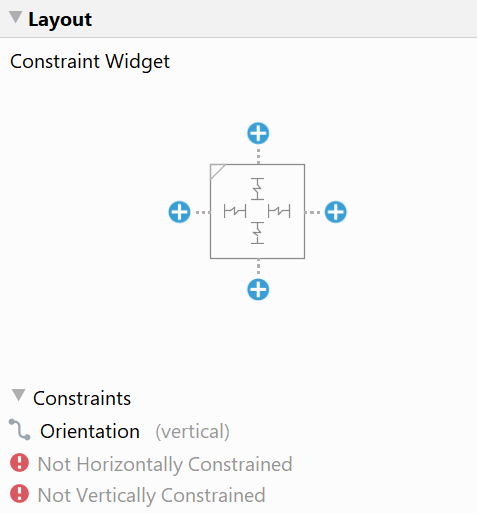
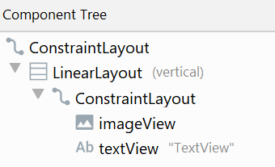
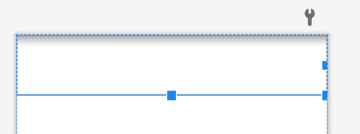

# User Interface
{: .reading]}

The User Interface (UI) or Graphical User Interface (GUI) is arguably the most important part of a program. True, functionality is crucial too, but all the functions of non-trivial programs are hidden behind the UI. If the UI is poorly designed, users tend to look for alternatives.

In this session, we will have a look at the tools available to design a basic UI. As an example, we will create an activity that shows a simple **contact form** where the user can input personal details and a message:


In this example, we will use different **Widgets**

- TextView
- EditText
- ImageView
- Switch
- Button

and **Layouts**

- ConstraintLayout
- LinearLayout
- TableLayout

as well as some layout elements to build the user interface according to the picture.

# AndroidStudio Layout Editor
*AndroidStudio* includes a powerful [**layout editor**](https://developer.android.com/studio/write/layout-editor){:target="_blank"} that makes building a functional UI relatively easy. However, as is common with powerful tools, there is a **learning curve** involved. Due to the wide array of possibilities to design the interface, it may be hard to find your way around the editor in the beginning.

The Layout Editor appears when you open an XML layout file.


1. **Palette**: Contains various views and view groups that you can drag into your layout.
2. **Component Tree**: Shows the hierarchy of components in your layout.
3. **Toolbar**: Click these buttons to configure your layout appearance in the editor and change layout attributes.
4. **Design editor**: Edit your layout in Design view, Blueprint view, or both.
5. **Attributes**: Controls for the selected view's attributes.
6. **View mode**: View your layout in either Code code mode icon, Design design mode icon, or Split split mode icon modes. Split mode shows both the Code and Design windows at the same time.
7. **Zoom and pan controls**: Control the preview size and position within the editor.

## Design View and Code View
The layout editor enables us to design the UI by dragging **widgets** like a *TextView* onto the screen and adjusting its attributes with a live preview. This is called the **design view**.

The **actual layout code** can be seen when switching to **code view**. There we see the XML code that the layout is based upon.

````xml
<?xml version="1.0" encoding="utf-8"?>
<LinearLayout xmlns:android="http://schemas.android.com/apk/res/android"
    xmlns:app="http://schemas.android.com/apk/res-auto"
    xmlns:tools="http://schemas.android.com/tools"
    android:layout_width="match_parent"
    android:layout_height="match_parent"
    android:orientation="vertical">

    <androidx.constraintlayout.widget.ConstraintLayout
        android:layout_width="match_parent"
        android:layout_height="80dp">

        <ImageView
            android:id="@+id/imageView"
            android:layout_width="match_parent"

...
````

The actual layout is **only** defined in code in the XML. The design that we see in design mode is just a representation. When we change something in design mode, the actual change is done in the code and the design is updated accordingly. Very complex designs are done in code, rather than using the design view. However, in this course we will only seldom find a reason to design directly via code view.

# Workshop: Contact Form Activity
{: .reading}

Let's start by creating a new AndroidStudio project using the "Empty Activity" template.


This template creates a first activity with a simple UI. Select "app/res/layouts/activity_main.xml" in the project tree:


This opens the layout editor and shows an UI that consists of a ``ConstraintLayout`` that fills the whole screen and a ``TextView`` with the text "Hello World!" written in the center of the screen:


If we have a look at the code view, we see the according XML:

````xml
<?xml version="1.0" encoding="utf-8"?>
<androidx.constraintlayout.widget.ConstraintLayout xmlns:android="http://schemas.android.com/apk/res/android"
    xmlns:app="http://schemas.android.com/apk/res-auto"
    xmlns:tools="http://schemas.android.com/tools"
    android:layout_width="match_parent"
    android:layout_height="match_parent"
    tools:context=".MainActivity">

    <TextView
        android:layout_width="wrap_content"
        android:layout_height="wrap_content"
        android:text="Hello World!"
        app:layout_constraintBottom_toBottomOf="parent"
        app:layout_constraintLeft_toLeftOf="parent"
        app:layout_constraintRight_toRightOf="parent"
        app:layout_constraintTop_toTopOf="parent" />

</androidx.constraintlayout.widget.ConstraintLayout>
````

## 'root' Layout
The uppermost layout that is shown in the component tree is called the **root layout**. By default, this is of the type ``ConstraintLayout`` and you should leave it this that way if you don't have compelling reasons to change it. The ``ConstraintLayout`` is one of the most flexible layouts and therefore well suited as the root layout.

## 'TextView' Widget
One of the most basic widgets that is available in the **Palette** is the ``TextView`` to display some text. Some important **attributes** are

- **id**: The *unique* id of the widget
- **text**: The text that is displayed
- **textSize**: The size of the text
- **textStyle**: Normal/bold/italic text style
- **style**: Predefined text style like *header*, *label*, ...
- **textColor**: The font color

**Play around with different attributes to notice their effect.**

>Afterwards, delete the ``TextView`` that displays the "Hello World!" message to continue.

# Creating the Basic Layout Structure


When looking at the proposed UI, you should notice the basic layout has a **row-like structure**. There is a header including a background image, a section to input personal information, a row for the message and so on.

The easiest way to build such a structure is using a ``LinearLayout (vertical)``. This layout creates sections that behave like a list of rows. Exactly what we want in this case.

> Drag and drop a ``LinearLayout (Vertical)`` from the Palette (Section: Layouts) onto the root layout.

Beware that the `LinearLayout (Vertical)` is a direct child of the `ConstraintLayout`:


When you select the ``LinearLayout (Vertical)`` in the component tree, you will notice red exclamation marks in the layout section of the attributes, telling you that it is
- Not horizontally constrained
- Not vertically constrained
  


Any child of ``ConstraintLayout`` needs to have horizontal and vertical constraints defined, hence the name. In our case, we want the ``LinearLayout (Vertical)`` to fill the entire activity screen. So we define constraints such that

- the **left edge** of the ``LinearLayout (Vertical)`` has *0 offset* from the **parent's left edge** (``ConstraintLayout``)
- the **top** of the ``LinearLayout (Vertical)`` has *0 offset* from the **parent's top**
- the **right edge** of the ``LinearLayout (Vertical)`` has *0 offset* from the **parent's right edge**
- the **bottom** of the ``LinearLayout (Vertical)`` has *0 offset* from the **parent's bottom**


> Click on the blue ``+`` signs to create constraints, leaving the default value of ``0``. In our case, this adds the attributes

- ``layout_constraintBottom_toBottomOf="parent"``
- ``layout_constraintTop_toTopOf="parent"``
- ``layout_constraintStart_toStartOf="parent"``
- ``layout_constraintEnd_toEndOf="parent"``


When you read the created attributes' names carefully, you sould notice that you can read the constraints they represent like an english sentence:

>``layout_constraintBottom_toBottomOf="parent"``:
>*Constrain the bottom of [this layout] to the bottom of the parent, with 0 offset*.

In fact, we made the ``LinearLayout (Vertical)`` take up the same screen space as its parent, the ``ConstraintLayout``.

**If you break your layout at any point, feel free to copy the code of the linked activity_main.xml in each step into your own code view:**

[>Layout Code for this step<](../../assets/source/003_ui/01_activity_main.xml){:target="_blank"}

## Image Header
Let's fill our layout with life and create a simple image header. In the picture of the final layout, we see that the header consists of an image with some text printed on top of it.


If we have a look at the **Blueprint view**, we see the structure even clearer.


> Drag and drop following widgets from the palette to your component tree:
> - ``ConstraintLayout`` as **child** of our LinearLayout
> - ``ImageView`` as **first child** of the new ConstraintLayout (choose the image "backgrounds/scenic" for now, when asked)
> - ``TextView`` as **second child** of the new ConstraintLayout

At this point, your component tree should look like this:



### Styling the Image Header

Right now, the header takes up the whole screen. The reason for this is, that the ``ConstraintLayout`` that is a child of the ``LinearLayout (Vertical)`` has the attribute ``layout_height`` set to ``match_parent``, i.e. it has the same height as ``LinearLayout (Vertical)``, which is the whole screen.

> Change the ``layout_height`` to ``80dp``



Next, let's have a look at the ``TextView`` and ``ImageView``. their layout attributes are also way off, right now they are located down beneath the bottom of the screen. However, you may have noticed that both have the red exclamation marks shown next to them, meaning that they are still unconstrained. Let's change that now:

> Select ``TextView``
> 
> Set the attribute ``layout_height`` to ``0dp`` (``0dp (match_constraint)`` when using the drop down menu)
> 
> Click on the blue ``+`` circles in the layout section of the attributes and fill in `0` as the offset on each side (like we did earlier)
>
> Repeat this for the ``ImageView``

The image header should now look like this:


### ImageView
Now we see that the image does not fit the header. We need to change an attribute which controls how the image is scaled inside the available space.

> Select the `ImageView` in the component tree
> 
> Change the attribute `scaleType` to `centerCrop`

> **Hint**: To easily find attributes in the list, you can use the search function by clicking on the magnifying glass icon
> 
> 

### TextView
Now let's style the text inside the image to something that looks halfway decent.

> Select the `TextView` in the component tree
>
> Change the attributes:
> - ``text``: `Contact us...`
> - ``textSize``: `30sp`
> - ``layout_height``: `wrap_content`
> - ``textColor``: Select `white`
> - ``paddingStart``: ``30dp`` (expand the attribute ``padding`` to see this)

Notice the changes each attribute has on the layout. The values provided are just for reference, **feel free to adjust them to your liking**. In the end, it will look similar to this:


[>Layout Code for this step<](../../assets/source/003_ui/01_activity_main.xml){:target="_blank"}