# Overview
{: .reading}

* This will become a table of contents (this text will be scrapped).
{:toc}

# Activities and their life cycle
{: .reading}

In the Android ecosystem, each screen you see is an `Activity`. An `Activity` can belong to your app (e.g. a **highscore screen** or a **graph display**)  or it can be a system screen (e.g. **phone dialer**, **system settings**).

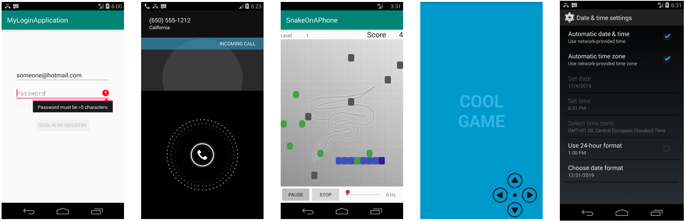

As a user navigates through, out of, and back to your app, the ``Activity`` instances in your app **transition through different states** in their lifecycle. The ``Activity`` class provides a number of **lifecycle methods** that allow the activity to know that a state has changed: that the system is creating, stopping, or resuming an activity, or destroying the process in which the activity resides. 

## Life Cycle Methods

Within the lifecycle methods, you can declare how your activity behaves when the user leaves and re-enters the activity. For example, if you're building a streaming video player, you might pause the video and terminate the network connection when the user switches to another app. When the user returns, you can reconnect to the network and allow the user to resume the video from the same spot. In other words, each lifecycle method allows you to perform specific work that's appropriate to a given change of state.


There exist 6 lifecycle methods which represent pairs of start and end of particular events: create/destroy, start/stop, pause/resume.
  - ``onCreate``
  - ``onStart``
  - ``onResume``
  - ``onPause``
  - ``onStop``
  - ``onDestroy``


# Workshop: LifeCycler
{: .reading}

This sessions app will demonstrate the basic use of the lifecycle events of an activity. We will create a list where all the occurring lifecycle events will be displayed with a timestamp.

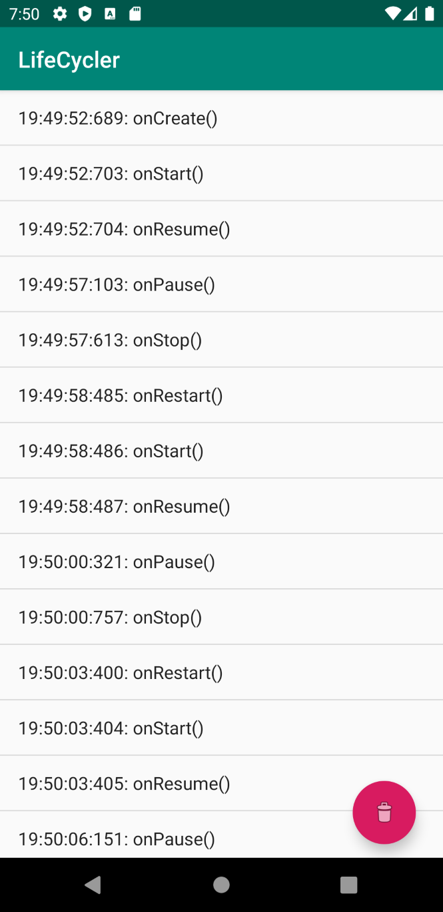

After this session, you will
- know when lifecycle events occur,
- know how to use lifecycle methods,
- know 2 new widgets: ``RecyclerView`` and ``FloatingActionButton``,
- be able to create simple custom UIs for lists
- use logging and logging levels

## New Project

Open Android Studio and create a new project using the "Empty Views Activity" Template.

Choose an appropriate name and save location, e.g. "LifeCycler" and "C:\Android\Projects\LifeCycler"

## Layout

We will start by designing the layout of the app. Switch over to the layout editor by opening "activity_main.xml" under "res/layout"

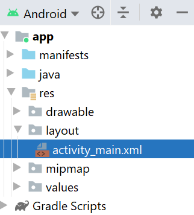

> Start by deleting the predefined "Hello World" ``TextView`` from the component tree, but **leave the ``ConstraintLayout``**.

### RecyclerView

The central widget of this demo app will be a `RecyclerView`, which displays a scrollable list of widgets. In the most basic case, which we will use here, the list consists of `TextView`s which contain text. However, it is also possible to have a list of buttons or even a whole composition of widgets (think: list of facebook/reddit posts with text, images, like buttons, etc).

> Drag and drop a ``RecyclerView`` (Palette: Containers) into your component tree as child of the root layout `ConstraintLayout`.
>
> Set an appropriate `id` (e.g. `recyclerViewEvents`) and **add constraints** so that the ``RecyclerView`` spans the whole screen. *Hint: Check previous lectures if you forgot how this is done.*

You will see a list with sample entries.

[>Layout Code for this step<](../../assets/source/004_ui/activity_main_1.xml){:target="_blank"}

## Populating the RecyclerView in Code

Static text entries in a `RecyclerView` are seldom enough. Typically, we want to display items dynamically when they become available during the execution of the app, at **run time**. So we need a way to add/remove items from the list from our application code. To achieve this, we have to first *link* the `RecyclerView` in the layout with a variable of type `RecyclerView` in our code.

> Open "MainActivity.java"

Here we have you first encounter with a **lifecycle method**, ``onCreate``. This method is called by the system **when the activity is created**, long before the layout is shown to the user. This is also the spot where the layout is created by the `setContentView(layout)` method. The `onCreate` lifecycle method is therefore the perfect place to populate our ``RecyclerView``.

> Inside the `onCreate` method, create a new local variable `recyclerView` of type `RecyclerView`. The *linking* of this variable to the widget in the layout is done with the method `findByViewId(id)`. We make use of the `R` object which provides access to resources such as **layouts** and widget **ids**. *Hint: If you use the auto-complete feature when using previously unused types, the necessary import-statement will be added automatically.*


````java

RecyclerView recyclerView;

protected void onCreate(Bundle savedInstanceState) {
        super.onCreate(savedInstanceState);
        // set activity content to layout defined in 'activity_main.xml'
        setContentView(R.layout.activity_main);
        
        // Create local variable and link ListView widget
        recyclerView = (RecyclerView)findViewById(R.id.recyclerViewEvents);
    }
````

As explained above, the `RecyclerView` is not simply a list of texts, but actually a list of widgets. So we need to tell the `RecyclerView` which widgets to use as list items and what their content should be. For this purpose, so called `Adapter` objects are required. Such an adapter object translates (adapts) between the widget (what the user interacts with) and the underlying data (what the program interacts with). Here, we will use an `RecyclerViewAdapter` to create a simple list of text items.

### A Simple Layout for List Items
Before we can continue with defining our `Adapter`, we need to create the layout for our list items. We want a simple layout containing just `TextView`s.

> Select the folder "res/layout", right-click and choose "New > Layout Resource File"

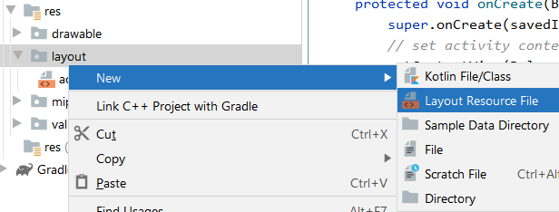

> Set the name of the new resource file to "message". Populate the layout file with two `TextView`s next to each other. Add some margins/padding to make sure they do not stick to each other. The `ConstraintLayout` should wrap the content to make sure it is only as big as the elements. Set meaningful IDs to the elements.

[>Layout Code for this step<](../../assets/source/004_lifecycle/simple_list_item.xml){:target="_blank"}


### Creating the Adapter

> Before we create our `Adapter`, we create a so called `ViewHolder`. It is a class that contains the view elements of our message item layout file, keeping the information at one place, information flow unilateral and easily extendable. It extends the superclass from the `RecyclerView` and the constructor we connect our view IDs. Therefore create a new file containing the java class.

````java

public class RecyclerViewAdapter extends RecyclerView.Adapter<MessageViewHolder> {

    List<MessageData> list;
    Context context;

    RecyclerViewAdapter(List<MessageData> list, Context context)
    {
        this.list = list;
        this.context = context;

    }

    @NonNull
    @Override
    public MessageViewHolder onCreateViewHolder(@NonNull ViewGroup parent, int viewType) {
        LayoutInflater inflater = LayoutInflater.from(context);

        // Inflate the layout
        View messageView = inflater.inflate(R.layout.message, parent, false);

        MessageViewHolder viewHolder= new MessageViewHolder(messageView);
        return viewHolder;
    }

    @Override
    public void
    onBindViewHolder(final MessageViewHolder viewHolder,
                     final int position)
    {
        viewHolder.txtMessage.setText(list.get(position).message);
        viewHolder.txtTime.setText(list.get(position).time);

    }

    @Override
    public int getItemCount()
    {
        return list.size();
    }
}
````

> Next we can create the `Adapter` class. Create a java file with the class name again. We extend the superclass `RecyclerView.Adapter<MessageViewHolder>` and override some of its methods. In the constructor we make sure that the correct `context` can be set and the right data is connected to the view items. The overriden methods `onCreateViewHolder` and `onBindViewHolder` are called when the view is created or a new item is bound to the view. Therefore we inflate the message layout and set the contents in those methods. The method `getItemCount` is abstract in the superclass and also has to be overridden and returns the size of our list.

````java

public class RecyclerViewAdapter extends RecyclerView.Adapter<MessageViewHolder> {

    List<MessageData> list = Collections.emptyList();
    Context context;

    RecyclerViewAdapter(List<MessageData> list, Context context)
    {
        this.list = list;
        this.context = context;

    }

    @NonNull
    @Override
    public MessageViewHolder onCreateViewHolder(@NonNull ViewGroup parent, int viewType) {
        LayoutInflater inflater = LayoutInflater.from(context);

        // Inflate the layout
        View messageView = inflater.inflate(R.layout.message, parent, false);

        MessageViewHolder viewHolder= new MessageViewHolder(messageView);
        return viewHolder;
    }

    @Override
    public void
    onBindViewHolder(final MessageViewHolder viewHolder,
                     final int position)
    {
        viewHolder.txtMessage.setText(list.get(position).message);
        viewHolder.txtTime.setText(list.get(position).time);

    }

    @Override
    public int getItemCount()
    {
        return list.size();
    }
```` 

> In ``onCreate``, create a java `ArrayList<String>` instance as the underlying data storage for the `String`s that we want to display in the `ListView`.
> 
> Create a new ``ArrayAdapter`` using our list item layout ``R.layout.simple_list_item`` and the data list.

````java
        // Create list data storage (String)
        listData = new ArrayList<>();
        // Create ArrayAdapter to displays a list of texts (String)
        listAdapterEvents = new ArrayAdapter<>(this, R.layout.simple_list_item, listData);
````

Next, we tell the `ListView` to use our adapter

````java
        // Set adapter to be used by list view
        listViewEvents.setAdapter(listAdapterEvents);
````

At this point, we can start adding `String`s to our data list so that they are displayed as items in the `ListView`. A simple `for` loop to add a bunch of `String`s will do for now. For reasons of performance, the actual list widget is not updated everytime we change the underlying data. So we have to tell the system, once we are finished manipulating the data list, so that the graphics can then be updated in one go. The method `notifyDataSetChanged()` of the ``ArrayAdapter`` is called for this. 

````java
        // Fill data list with dummy events
        for(int i = 0; i < 10; i++) {
            listData.add(String.format("Event #%d", i));
        }

        // notify the adapter that the underlying data has changed
        listAdapterEvents.notifyDataSetChanged();
````

> Run the app to verify that everything is working so far.

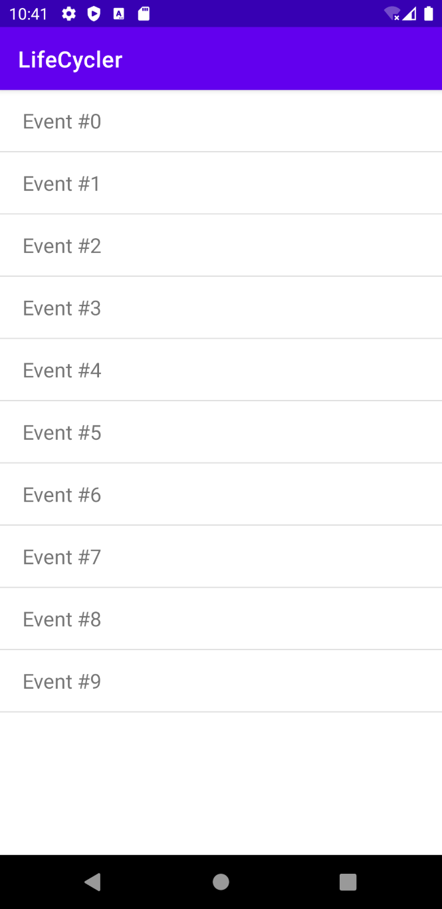

[>Program Code for this step<](../../assets/source/004_lifecycle/MainActivity_1.java){:target="_blank"}

## Lifecycle Methods

The underlying purpose of our app is to show **how lifecycle methods work**. The next step is therefore to add those methods to our activity. All lifecycle methods are defined in the class `Activity` which is a **super class** of our `MainActivity`. As we want to add our own code to these methods, we **override** them in our class.

> Add following methods to your `MainActivity` class

````java
    @Override
    protected void onStart() {
        super.onStart();
    }

    @Override
    protected void onResume() {
        super.onResume();
    }

    @Override
    protected void onPause() {
        super.onPause();
    }

    @Override
    protected void onStop() {
        super.onStop();
    }

    @Override
    protected void onDestroy() {
        super.onDestroy();
    }
````

The `@Override` is just a marker (annotation) which tells us that this method is intended to be overridden. It could be omitted without any ill effects. However, as a developer you are able to see **immediately** which methods are overridden from super classes and which are defined in your won class. This is very valuable information to have at a glance, so we like to keep those `@Override` annotations around.

One more thing to note is the call to ``super`` in all of those methods. It is important to keep this in all lifecycle methods. If we were to omit the `super` call, then super classes could not react to lifecycle events any longer, because according to the laws of java inheritance, only our lifecycle method gets called by the system. Therefore, it is imperative to include the call to the appropriate `super` method so that the code in the super classes also gets executed. Weird stuff can happen otherwise.

### Adding list items on lifecycle events

Let's go ahead and add a new item to our list whenever one of the lifecycle events occurs. First, we create a new method to prepend the current timestamp to a text in a `String` parameter and append the result to the list.

````java
    private void addListItem(String name) {
        // create formatted timestamp HH:mm:ss.SSS of current time
        String timeNow = LocalTime.now().format(DateTimeFormatter.ofPattern("HH:mm:ss.SSS"));
        // combine timestamp and parameter
        listData.add(String.format("[%s] %s", timeNow, name));

        // notify the adapter that the underlying data has changed
        listAdapterEvents.notifyDataSetChanged();
    }
````

Once we created `addListItem(String)`, we can add it to each of the lifecycle methods. Additionally, we add an entry to our Log.

````java
    @Override
    protected void onStart() {
        super.onStart();

        // Log event and add to list
        Log.d("OnLifeCycle", "onStart()");
        addListItem("onStart()");
    }

    @Override
    protected void onResume() {
        super.onResume();

        // Log event and add to list
        Log.d("OnLifeCycle", "onResume()");
        addListItem("onResume()");
    }

    @Override
    protected void onPause() {
        super.onPause();

        // Log event and add to list
        Log.d("OnLifeCycle", "onPause()");
        addListItem("onPause()");
    }

    @Override
    protected void onStop() {
        super.onStop();

        // Log event and add to list
        Log.d("OnLifeCycle", "onStop()");
        addListItem("onStop()");
    }

    @Override
    protected void onDestroy() {
        super.onDestroy();

        // Log event and add to list
        Log.d("OnLifeCycle", "onDestroy()");
        addListItem("onDestroy()");
    }
````

Also, don't forget to also add it to ``onCreate``.
````java
@Override
    protected void onCreate(Bundle savedInstanceState) {
        super.onCreate(savedInstanceState);

        [...]

        // Log event and add to list
        Log.d("OnLifeCycle", "onCreate()");
        addListItem("onCreate()");
    }
````

> Run the program and notice the lifecycle events happening when you put the app in the background repeatedly.

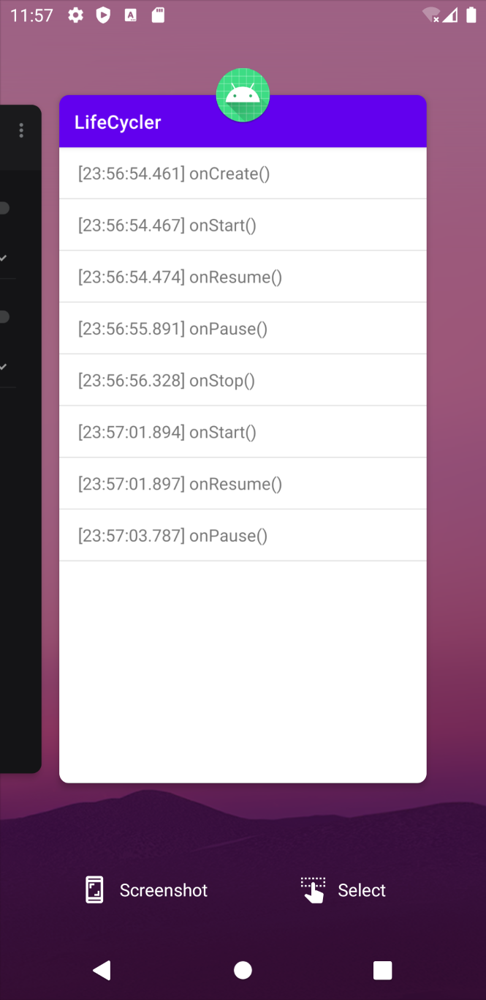

Notice the events happening always in a specific order. Also notice the ``onPause`` and ``onStop`` events happening right after one another. However, when putting the app in the background, we see only `onPause` on the screenshot. Even though those two events are happening back to back, `onPause` is the last event happening while the UI is still responsive while `onStop` happens when the UI is no longer updated, hence we don't see the event on the screenshot, even if we see it in the log file.

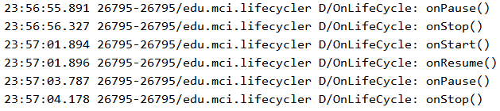

[>Program Code for this step<](../../assets/source/004_lifecycle/MainActivity_2.java){:target="_blank"}

## FloatingActionButton

As a last step, we will add a ``FloatingActionButton`` to finally *destroy* the app. As the name suggests, this widget is a simple button that has a drop shadow underneath so that it looks like floating above the rest of the screen. We will use it to send the `onDestroy` event to the app.

> Go to the layout editor by opening the layout file "activity_main.xml".
> 
> Add a ``FloatingActionButton`` as the last child of the ``ConstraintLayout`` (*be careful not to drop the ``FloatingActionButton`` as child of the ``ListView``*). If asked, choose any image you like.
> Set an appropriate `id` (e.g. `fabDestroy`).
>
> Set the constraints of the ``FloatingActionButton`` be be in the bottom right by dragging it's handles.

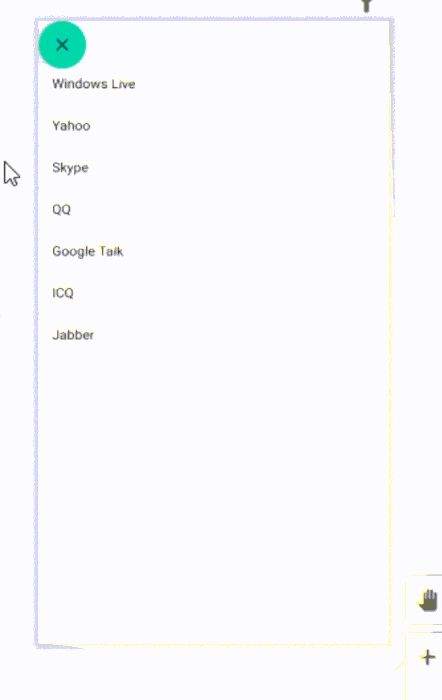

> Increase the offset of the constraints so that the button does not hug the sides.

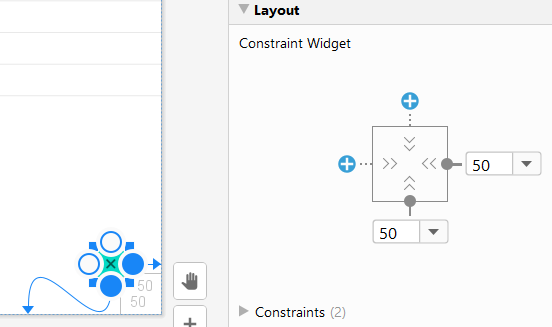

[>Layout Code for this step<](../../assets/source/004_ui/activity_main_2.xml){:target="_blank"}

## Click and Destroy

Go back to our code in "MainActivity.java". We need to link the `FloatingActionButton` in the layout to our code and install a click listener. A click listener allows us to implement actions when the user clicks on the button. Add following lines to `onCreate`:

````java
        // Create local variable and link FAB widget
        FloatingActionButton fabDestroy = findViewById(R.id.fabDestroy);
        // Install click listener
        fabDestroy.setOnClickListener(new View.OnClickListener() {
            @Override
            public void onClick(View v) {
                Log.w("OnLifeCycle", "Finish it!!!!!1");
                MainActivity.this.finish(); // exits the activity
            }
        });
````

> Run the program again. When you click the button, you will find onDestroy() in the log.

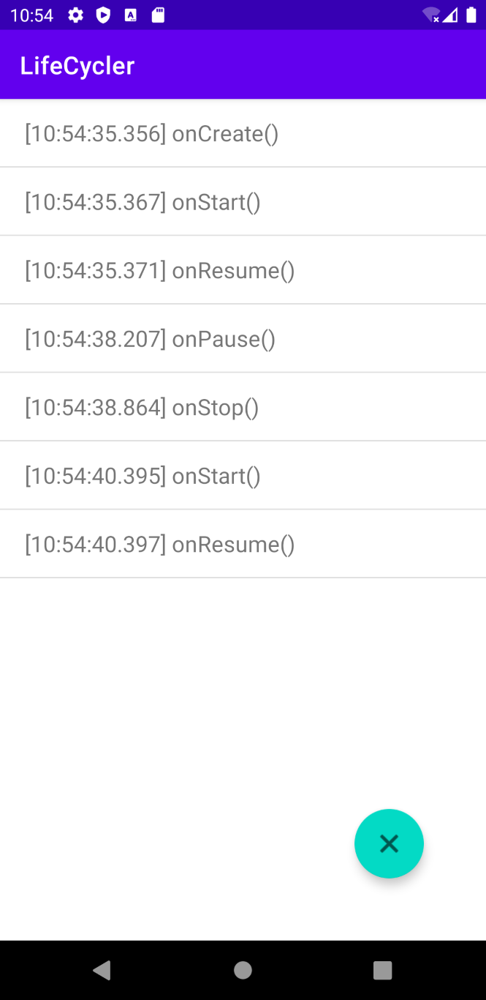

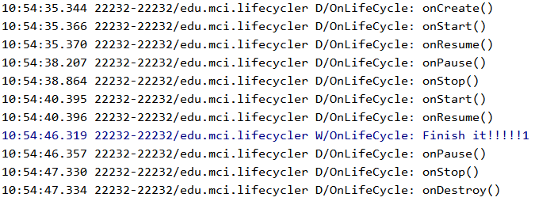


[>Program Code for the final step<](../../assets/source/004_lifecycle/MainActivity_3.java){:target="_blank"}
