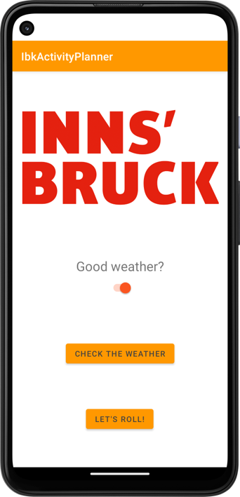
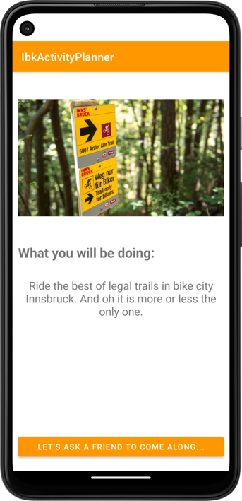

# Overview
{: .reading}

* This will become a table of contents (this text will be scrapped).
{:toc}

# Workshop: Intents
{: .reading}




In this session we will have a look how **Intents** work and what they are used for. Go through the steps to add implicit and explicit intents. Use logging to check whats happening.

## Open the IbkActivityPlanner

Download the .zip archive and save it to a location you prefer and unpack it. Then open Android Studio, choose File->open to open the project.

## Explore the App

If you have not already, have a look around the app. What kind of activites are already there and what are they doing?

We have two activites, the `MainActivity` and the `ShowActivity`. In this case we could guess which one would be launched first when the app is started, but there are cases where the `Main` is actually not the launched activity, e.g. imagine a log-in activity which is only called when opening the app the first time. One possibility is to have a look on the intent-filter in the manifest file discussed later in this lesson. First let's have a look how we switch from first to second activity.

## Intent to start the show activity

In the `MainActivity.java` we find the following code in the onClick Listener of the button to start the show activity:

````java
Intent i = new Intent(MainActivity.this, ShowActivity.class);
startActivity(i);
````
Basically the intent specifies the starting context and where it should move to. The `startActivity()` method then does the actual work. As we stay inside the activity and tell the exact target it is an *implicit* intent.

### Intent with extra information

Sometimes we want to pass on basic information from the starting activity to the target activity. A good example could be the `isGoodWeather` variable. Now it is implemented as a static variable and a getter to be used by the other activity. Let\'s change that to a android specific process of using an intent with extra information.

First you can delete the getter and the static keyword for the variable. Then simply add the line:

````Java
i.putExtra("currentWeather", isGoodWeather);
````
in between creating the intent and starting the next activity. To make it work, switch to the `ShowActivity.java` file. The information is stored as a so called *key-value pair*, i.e. the specified string can be anything you like. You just have to remember the *key* as soon as you need the *value*. At the beginning of the `onCreate()` method (but after `super...` and `setContentView(...` add the lines:

````Java
Intent myIntent = getIntent();
final boolean currentWeather = myIntent.getBooleanExtra("currentWeather", true);
````

Finally, adapt the code to work with the new variable instead of the getter.

Have a testrun of the app and see if the information is passed on successfully.

## Explicit intents

The second type of intents are explicit, that means we ask the system to perform a certain action but we do not specify how and by whom it will be carried out. In this example you will implement two different ones:
- Conducting a websearch for our current weatherforecast in innsbruck and
- Send a message to a friend to ask to join you in your activity.

Before you can do that, add an additional button in the `main_activity.xml` and the `activity_show.xml` and connect them to the code. Create onClick listeners where you can add the intents. The intent to check the weather is an explicit intent using the action `ACTION_WEB_SEARCH` while the other one uses the action `ACTION_SEND`. But how does the system know who can actully perform such an action?

### The intent filter
As mentioned before, the intent filter is to be found in the manifest file of the android project. It belongs to an activity and looks like this:

````XML
        <activity
		...
            <intent-filter>
                <action android:name="android.intent.action.MAIN" />
                <category android:name="android.intent.category.LAUNCHER" />
            </intent-filter>
		...
		</activity>
```` 
You can see that for this activity the action `MAIN` is specified whereas the category specifies who can ask for this kind of action. This basically tells us that the activity will be the activity that will be started by the launcher initializing the application.

In the use context of the innsbruck activity planner this means that some other applications have to have one of these two actions specified in their intent filter to be able to perform receive the intent.

### Implement explicit intents

In the listeners created before you can add the websearch intent by adding the lines:

````Java
Intent intentCheck = new Intent(Intent.ACTION_WEB_SEARCH);
intentCheck.putExtra(SearchManager.QUERY, "Wetter Bergfex Innsbruck");
startActivity(intentCheck);
````

and 

````Java
Intent sendIntent = new Intent();
sendIntent.setAction(Intent.ACTION_SEND);
sendIntent.putExtra(Intent.EXTRA_TEXT, "Bisch am Start?");
sendIntent.setType("text/plain");
startActivity(sendIntent);
````

respectively. As you can see, the extra information which is needed or optional for the intent varies by the action. You can have a look on the most common ones and examples [here](https://developer.android.com/guide/components/intents-common){:target="_blank"}.

Here is also a good time to test run your application and try out the new functionality.

# Improve the UI

At this point you can also start to improve the look of the user interface. If you have not tried already, you can run your app and change the orientation of your phone. 

> On the physical device, this is straight forward but on the virtual you have to confirm the orientation change by clicking on the button that appears in the lower left corner after you clicked on the *rotate left* or *rotate right* button on top of your emulator.

What do you observe?

If you did not improve the UI by yourself, you will find that elements are shifted around and probably not all the information is visible anymore, regardless of being in the main or show activity. Of course there are multiple ways to solve the problem, here you will try to implement a `scrollView` to both the activities to ensure that even if the information does not have enough space on the screen, the user can at least scroll down to see it.

Let\'s start with the `activity_main.xml`. You can see that at the moment, everything is in the constraint root layout. Navigate to the *containers* and add a `scrollView` to the root layout and specifiy its constraints. You can see that along with the `scrollView` a `linearLayout` nested inside was also added. By adding the UI elements to the `linearLayout` we make them scrollable. Consider to keep elements outside if you do not want them to be scrollable. Arrange them as you like. Inside the `linearLayout` other layouts can also be nested as per usual.

The result then looks something like this:


Here you can also find the .xml code as a reference. Beware that maybe it won\'t work out of the box as your elements may have different names/id\'s.

[>Scrollable layout code<](../../assets/source/005_intent/06_activity_main.xml){:target="_blank"}

Proceed by applying the same to the `activity_show` by yourself.

## Bonus: Style and color

In your *resources->values->themes* you can find a `themes.xml` for your light and dark mode respectively. Here, the basic theme for your app is specified and can be customized. You can choose your primary and secondary colors as well as status bar color.

> To choose and play around with your colorset, have a look at the colors.xml file.

Another possibility is to change the basic appearance of the application by specifying if the *ActionBar* should be visible or not. If you wish to remove it, you can change the line:

````XML
<style name="Theme.IbkActivityPlanner" parent="Theme.MaterialComponents.DayNight.DarkActionBar">
````
to
````XML
<style name="Theme.IbkActivityPlanner" parent="Theme.MaterialComponents.DayNight.NoActionBar">
````

> The action bar is the bar on top which in our case only shows the application name at the moment.

# Add audio

To enhance the user experience of this very usefull application some more, a simple audio notification is added to the application. The idea is to tell the user also via audio if the application found an activity to be done in innsbruck.

First we have to add a soundfile to be played to the application. You can either download the file on Sakai *Resources->Lessons* or use your own little sound. Save it to an arbitrary location you can find again.

> If you use your own sound make sure it uses a compatible format specified [here](https://developer.android.com/guide/topics/media/media-formats){:target="_blank"}.

To add it to the android project, right click on the *res* folter and choose *new->android resource directory*. Give it a name and specify the resource type with *raw*. Now the file can be added by copying it from the location and pasting it into the folder by right-click *paste*. Give it a usefull name and here we go.

Once the file is added to the project, move to the end of the `onCreate()` method in the `ShowActivity.java`. After the image and the text is set, create a `MediaPlayer` for the audio file we just added inside the context of the activity. By calling the `start()` method the sound is played.

````Java
MediaPlayer soundPlayer = MediaPlayer.create(this, R.raw.notification);
soundPlayer.start();
````

> Please refer to the [Documentation](https://developer.android.com/guide/topics/media/mediaplayer){:target="_blank"} if you want to use bigger files or streaming. For internet access adding permissions to the manifest file and as preparing the audio can take some time it should not be done in the UI thread.

