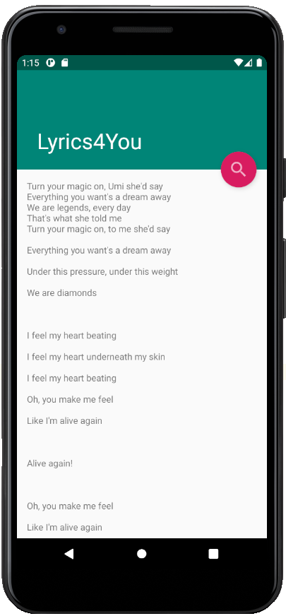
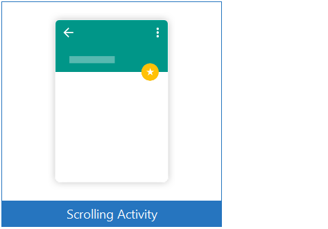
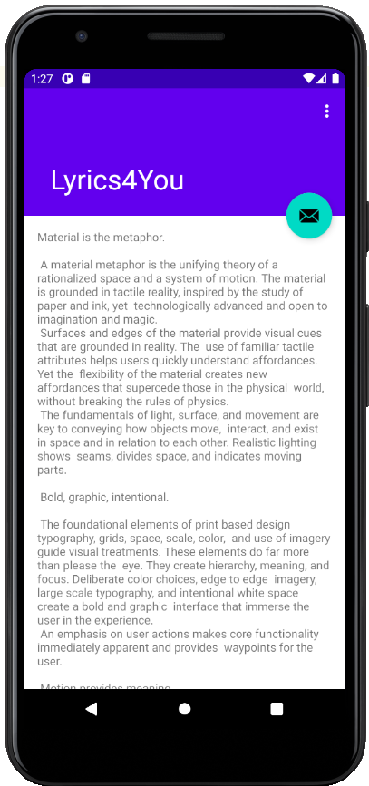
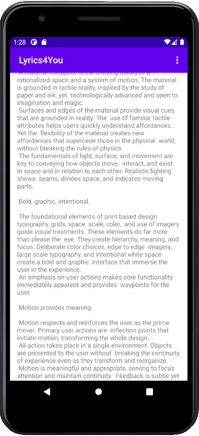
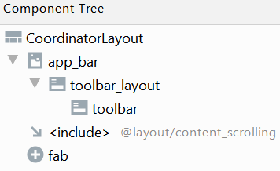
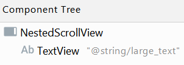
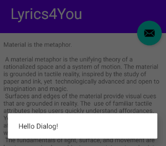
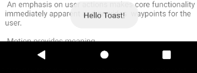
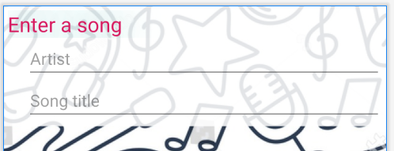

# Overview
{: .reading}

* This will become a table of contents (this text will be scrapped).
{:toc}

# Workshop: Song Lyrics
{: .reading}



In this session, we will create an app to look on the internet for lyrics of a song supplied by the user.

For this, we will need new things:
- Errors and error handling
- Background tasks
- Input dialogs

## New Project

Open Android Studio and create a new project using the "Scrolling Activity" Template.



Choose an appropriate name and save location, e.g. "Lyrics4You" and "C:\Android\Projects\Lyrics4You"

## Explore the App

We will start by running the app and exploring what the selected project template generated.

We see a **toolbar** with the apps name and an **options menu** on top. Additionally, a ``FloatingActionButton`` sits at the border of the toolbar. Next, we have a long text that can be scrolled.



Notice how the toolbar shrinks once you start scrolling to take up less space.



## Layout

Let#s have a look at the generated layout files. Notice that two layout files were generated: ``activity_scrolling.xml`` and ``content_scrolling.xml``. Switch over to the layout editor by opening "activity_scrolling.xml" under "res/layout".



There are some unfamiliar widgets present in the component tree. Notice the root layout is no longer a ``ConstraintLayout`` like we are used to, but a `CoordinatorLayout`. The children of the root layout are a ``Toolbar`` and a ``FloatingActionButton``. There is no sign of a ``TextView``, yet we clearly see it in the design view.

Notice the `include` element, it **includes** another layout file, here `content_scrolling.xml`. You can split your layout files to split your activities' layout into content and decoration.



Open `content_scrolling.xml` and there you see the `TextView` inside a `NestedScrollView`.

> Set the ``id`` attribute of the ``TextView`` widget to an appropriate value like `txtLyrics`.

### CoordinatorLayout and NestedScrollView

The ``CoordinatorLayout`` is responsible for the behavior that the ``Toolbar`` shrinks and the ``FloatingActionButton`` disappears when activity is scrolled. An in-depth description can be found in the [documentation](https://developer.android.com/reference/androidx/coordinatorlayout/widget/CoordinatorLayout){:target="_blank"}.


The `NestedScrollView` is a container element where the content can extends vertically beyond the height of the view. The overflow can then be scrolled.

We will not go into more details at this point and instead focus on using the layout as is.

>Feel free to customize the layout: Change the button image, change text styles or toolbar colors, etc.

## ScrollingActivity

Open the class `ScrollingActivity` to go to the code of the main activity of our app.

>Start by removing the methods `onCreateOptionsMenu` and `onOptionsItemSelected`, we wont be needing those.

The goal is to display song lyrics in the scrollable ``TextView``, so we create a property

````java
private TextView txtLyrics;
````

in our class and link it to the UI using the `findViewById` method in `onCreate`

````java
txtLyrics = findViewById(R.id.txtLyrics);
````

## Input Dialog

Next, let's create an **input dialog** where the user can input **artist** and **title** for which to look up lyrics.

A dialog is a modal view which can be displayed on top of an activity to interrupt the current screen and *show information*, ask the user for *confirmation* or demand *user input*.

The easy way to **build** a custom dialog is using a dialog `Builder`, here we are going to be using an `AlertDialog.Builder`. A `Builder` lets us configure the look and functionality of a dialog via convenient methods. An alternative would be to subclass `AlertDialog` and do everything on our own.

> Create a new method `showInputDialog` and create a new ``AlertDialog.Builder`` object.

````java
private void showInputDialog() {
        // create new dialog builder
        AlertDialog.Builder builder = new AlertDialog.Builder(this);
}
````

Double-check that you use the correct version of `AlertDialog` by looking at the ``import`` statement at the top of the file. The correct import definition is
````java
import androidx.appcompat.app.AlertDialog;
````

The `builder` object has methods that are used to configure the dialog. There is also a method `create()` that we will call afterwards to actually create the dialog according to the configuration.


> To show an empty dialog we add a message, a call to `create()` and ``show()``.

````java
private void showInputDialog() {
        // create new dialog builder
        AlertDialog.Builder builder = new AlertDialog.Builder(this);

        // configure button
        builder.setMessage("Hello Dialog!");

        // build actual dialog
        AlertDialog dialog = builder.create();
        
        // show the dialog to the user
        dialog.show();
}
````

> Call `showInputDialog()` when clicking on the `FloatingActionButton`.\
> Test it afterwards.

````java
...
        fab.setOnClickListener(new View.OnClickListener() {
            @Override
            public void onClick(View view) {
                showInputDialog();
            }
        });
...
````

Your screen should look like this



Let's add buttons to the dialog.

> Use the builder methods `setPositiveButton` and `setNegativeButton` to add an "Ok" and a "Cancel" button respectively

````java
....
        // configure button
        builder.setMessage("Hello Dialog!");

        builder.setPositiveButton("Ok", new DialogInterface.OnClickListener() {
            @Override
            public void onClick(DialogInterface dialog, int which) {
                
            }
        });
        builder.setNegativeButton("Cancel", new DialogInterface.OnClickListener() {
            @Override
            public void onClick(DialogInterface dialog, int which) {
                
            }
        });
...
````

To showcase the buttons, we will have a look at some new possibilities to show information to the user: ``Toast`` and ``Snackbar``.

>`Toast`s are short-lived, non-interactive, floating bubbles that contain text.\
>


>`Snackbar`s in contrast can be shown indefinitely and may optionally be interactive.\
>

When the user clicks on the "Cancel" button, let's show a ``Toast`` that says "Lookup cancelled".

````java
        builder.setNegativeButton("Cancel", new DialogInterface.OnClickListener() {
            @Override
            public void onClick(DialogInterface dialog, int which) {
                Toast.makeText(ScrollingActivity.this, "Lookup cancelled", Toast.LENGTH_SHORT).show();
            }
        });
````

When the user clicks on the "Ok" button, let's show a `Snackbar` that tells the user that the app is going to perform a lyric lookup.

````java
        builder.setPositiveButton("Ok", new DialogInterface.OnClickListener() {
            @Override
            public void onClick(DialogInterface dialog, int which) {
                Snackbar.make(txtLyrics, "Fetching lyrics for 'Artist - Title'", Snackbar.LENGTH_SHORT).show();
            }
        });
````

> Run the program to test it.

## Dialog Layout

Until now, we still have a dialog that says "Hello dialog!" instead of providing input fields. We have to create a layout for our input dialog.

> Create a new layout file `input_dialog.xml` in `res/layout`. *Hint: Right-click on res/layout, select "New>Layout Resource File"*.

You may want to use a `ConstraintLayout` as root layout (you don't have to!) and you may have to add it to your project. Click on the download button next to it's name.


> Build a layout similar to this \
> 

> At the minimum, you need two ``EditText`` widgets with the ``id``s `editArtist` and `editTitle`.
> 

Once we have a suitable layout, we need to tell our dialog builder to use this layout for our input dialog. This can be achieved with the builder's `setView` method (instead of ``setMessage``).

````java
        // configure button
        builder.setView(R.layout.input_dialog);
````

Inside the ``OnClickListener`` of the positive button, we can now access the text from the `EditText`widgets.

````java
        builder.setPositiveButton("Ok", new DialogInterface.OnClickListener() {
            @Override
            public void onClick(DialogInterface dialog, int which) {
                AlertDialog alertDialog = (AlertDialog) dialog;

                // use findViewById of the dialog!
                TextView editArtist = alertDialog.findViewById(R.id.editArtist);
                TextView editTitle = alertDialog.findViewById(R.id.editTitle);

                // get artist and title
                String artist = editArtist.getText().toString();
                String title = editTitle.getText().toString();

                // TODO execute background task

                // show information to user
                Snackbar.make(findViewById(R.id.txtLyrics), String.format("Fetching lyrics for '%s - %s'", artist,title), Snackbar.LENGTH_SHORT).show();
            }
        });
````
### Files for this step 
[>Dialog Layout Code<](../../assets/source/006_async/input_dialog.xml){:target="_blank"}

[>Dialog background image<](../../assets/img/006_async/music_bg.jpg){:target="_blank"}

[>ScrollingActivity<](../../assets/source/006_async/01_ScrollingActivity.java){:target="_blank"}


## Background Task

There are two very important paradigms in programming for mobile devices: **Responsiveness** and **Battery efficiency**.

### Responsiveness

A mobile program consists of multiple parallel processes/tasks. The main task is the **UI Task** and is in charge of displaying the app and interacting with the user.  So far, we only ever worked in the context of the main **UI Task** and this was fine.

However, some jobs take longer to complete (e.g. fetching data from the internet). If we were to naively perform this work inside the **UI Task**, then we would block it from doing other stuff like interacting with the user while we wait for our job to complete. As a result, the app would **freeze**.

We should never freeze the app for more than a few milliseconds at a time. Whenever we have a long running job, we therefore need to use a different task in parallel, so that the **UI Task** stays **responsive** (i.e. is able to react to touch inputs etc.).

### AsyncTask

One class to execute a job asynchronously is `AsyncTask`. It is ``abstract`` so we have to subclass it.

It provides the method `doInBackground` for performing work in the background as well as life-cycle methods like `preExecute` or `postExecute`.

> Create a new **inner class** `AsyncLyricsTask` that extends `AsyncTask`. `AsyncTask` can further be restricted to use certain types for it's **input**, **progress** and **output**. This is specified inside `< >` after the type

````java
    // asynchronous task which takes String parameters as input (artist, title) 
    private class AsyncLyricsTask extends AsyncTask<String, Void, Void> {
        
        // happens in background
        @Override
        protected Void doInBackground(String... strings) {

        }
    }
````

## Module lyricsfetcher

Before we continue, we have to download the module "lyricsfetcher" from [Sakai](https://sakai.mci4me.at/access/content/group/Course-ID-SLVA-34457/AndroidModules/lyricsfetcher.zip) and import it into our project. Unzip it.

> "File > New > Import Module..." and select the "lyricsfetcher" folder.

Then you should see the new module in your project structure on the left.


Open "build.gradle (Module: Lyrics4You.**app**)" and add the line `implementation project(":lyricsfetcher")` to ``dependencies``: 

````
dependencies {
    ...
    implementation project(":lyricsfetcher")
}
````

> Click "Sync now"

Now you should be able to create a `LyricsFetcher` object in your `LyricsAsyncTask#doInBackground`. In the end, your task will look like this

````java
    // asynchronous task which takes String parameters as input (artist, title)
    private class AsyncLyricsTask extends AsyncTask<String, Void, String> {

        // set text AFTER execution finished
        @Override
        protected void onPostExecute(String s) {
            txtLyrics.setText(s);
        }

        // happens in background
        @Override
        protected String doInBackground(String... strings) {
            // Get artist, title from parameters
            String artist = strings[0];
            String title = strings[1];

            // Create object to fetch lyrics
            LyricsFetcher fetcher = new LyricsFetcher("https://api.lyrics.ovh/v1/");

            String text;
            try {
                // Fetch lyrics
                LyricsFetcher.Result result = fetcher.fetchLyrics(artist, title);

                Log.i("LYRICS", String.format("Lyrics found for '%s - %s'", artist, title));
                text = result.lyrics;
            } catch (LyricsNotFoundException lnfe) { // ERROR: No lyrics found
                Log.i("LYRICS", String.format("No lyrics found for '%s -%s'", artist, title));
                text = String.format("No lyrics found for '%s -%s'", artist, title);
            } catch (IllegalArgumentException iae) { // ERROR: Arguments null
                Log.e("LYRICS", iae.getMessage(), iae);
                text = String.format("Error: %s", iae.getMessage());
            } catch (UnknownHostException uhe) {  // ERROR: No connection to host (internet down?)
                Log.e("LYRICS", "No connection to server.", uhe);
                text = "Error: No connection to server.";
            } catch (IOException e) {  // ERROR: Some other connection error
                Log.e("LYRICS", "Unable to get lyrics", e);
                text = "Error: Unspecified.";
            }
            return text;
        }
    }
````

In the end, we have to execute the background task when the user clicks on the dialog's "OK" button. Instead of the TODO in the positive button's `OnClickListener` add
````java
new AsyncLyricsTask().execute(artist, title);
````

> Try it.


### Files for this step

[>ScrollingActivity<](../../assets/source/006_async/02_ScrollingActivity.java){:target="_blank"}

When you run the program and try to get the lyrics, your app will crash. In the log file, there you will spot the cause:

````
Caused by: java.lang.SecurityException: Permission denied (missing INTERNET permission?)
````

We forgot to tell Android, that our app wants to access the internet!

> Open the file "AndroidManifest.xml" in the folder "app>manifests" and before the `</manifest>` add the line

````xml
...
    </application>

    <uses-permission android:name="android.permission.INTERNET" />

</manifest>
````

> Try again