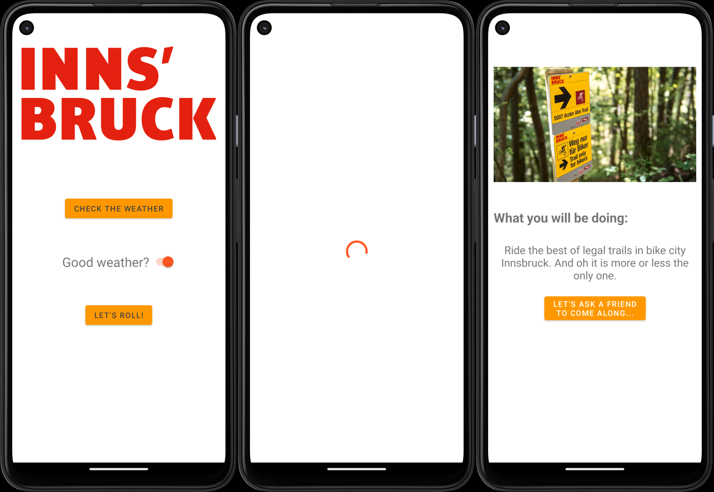

# Overview
{: .reading}

* This will become a table of contents (this text will be scrapped).
{:toc}

# Workshop: Asynchronous Task
{: .reading}




In this session, we will improve the already known IbkActivityPlanner application a little bit by implementing asynchronous execution of a background task and adapting the UI accordingly.

## Revisit the Last State

Open the application by using your implementation or download the state after the last lesson from Sakai.
Choose an appropriate name and save it to a local directory or repository.

Have a look at the files again.
What activities are used and what are they doing?

Especially important for this lesson is the code in `ShowActivity.java` as we want to improve the process of finding and showing the right activity to be done in Innsbruck this weekend :)

## Asynchronous Execution

As you have seen in the lecture, the execution of longer tasks on the *Main-Thread* (which is also the *UI-Thread* in Android) is problematic and therefore we need multitasking by using multiple *threads*.

>If you are not sure what is meant by asynchronous and synchronous execution of the difference between threads and processes, have a look at the slides from this week\'s lecture. You can find them in the resources on Sakai.

From the probably incomplete list presented in the lecture, we will have a closer look at two possibilities of asynchronous execution in android:
- An *Executor* and
- The *AsyncTask* class.
  
> The AsyncTask is deprecated but still works. I leave it here because it can be easier to understand.

If you want to try what would happen if there is a task which takes too long on the UI thread, add the code block below in the `onCreate()` method of the `ShowActivity`. It will pasue the thread which it is called on for the specified amount of milliseconds. 
**Do not use `Thread.sleep()` to time anything in your code! We use this here to intentionally make the app worse!** 

````Java
try {
    Thread.sleep(6000);
} catch (InterruptedException e) {
    e.printStackTrace();
}
````
> Make sure you remove the block afterwards again.

### Executor
The executor class provided by Android is an interface which allows working with `Runnables` flexibly. It removes the need to manually invoke new Threads in the classic Java way but most importantly allows to easily use `Runnables` for your tasks to be used with more powerful classes like the *ExecutorService*.
>`Runnables` are basically program blocks which qualify to run in their own thread. For more information have a look [here](https://developer.android.com/reference/java/lang/Runnable){:target="_blank"}.

Let\'s have a look at how to use the Executor with a custom `Runnable` and the `ExecutorService`. Create a private variable for the `ExecutorService` and the `Executor`. For the service we need to provide some input on how much threads should be in the pool (seems as if even in Java we sometimes need to think about hardware resources). The `Executor` is the superclass and we could only use that alone to do some background tasks. However, the service allows us to have a controlled shutdown which we will see later.

````Java
private ExecutorService executorService = Executors.newFixedThreadPool(2);
private Executor executor = executorService;
````
Here we specify the number of threads which will be available. As the size is fixed, the threads exist until the service is shutdown. To execute something in the background we will call the method `execute()` from the `executor` instance. It only takes one input parameter, which is the `Runnable`. You can either directly create a `new Runnable()` and implement it

````Java
executor.execute(new Runnable() {
	@Override
	public void run() {
		//Write your background code here
	}
});
````

or use something called a *lambda expression*.

````Java
executor.execute(() -> {
	//Write your background code here
});
````

Why does this work? As we know it has to be a `Runnable` (an interface with one method `run()` that has to be overridden) we can reduce the syntax and only write what would be inside the `run()`method. Of course you could also define a `Runnable` on its own and just give it to the executor by the time it needs to be executed.

Implement it in our `onCreate()` function and put the code what you think should run in the background. You can use the `Thread.sleep()` to make the background task a little bit longer and therefore more visible to the user. Now we still shut shutdown and release the processing resources again. Therefore it makes sense to call the `shutdown()` method in the appropriate lifecycle method of the activity.

> `shutdown()` will finish any executing tasks. Use `shutdownNow()` if you want to shutdown all background work of the service immediately.

Try to run the code. You will see that the GUI will be loaded and shown to the user even if the tasks in the background were not finished yet. It stays responsive so it is what we wanted right? Still we maybe do not want to see GUI elements if they are not set with the correct image and text yet. Jump to the *Adding a loading screen* section to improve our UI.

### AsyncTask

The AsyncTask class is using built in lifecycle-methods to simplify its use. We have four methods to our use:
- doInBackground() -> We **must** override this method as it specifies the tasks to be done in a background thread.
- onPreExecute() -> Is called **before** doInBackground() is called and executes it\'s code on the UI thread.
- onPostExecute() -> Is called **after** doInBackground() is finished and executes it\'s code on the UI thread.
- inProgressUpdate() -> Is called if doInBackground() calls *publishProgress()* and executes it\'s code on the UI thread.

In the `ShowActivity.java` we create a nested class inside *ShowActivity*. If you use codecompletion the doInBackground() method should be created for you. Inside the <> we will specify what the doInBackgound, onProgressUpdate() and onPostExecution() accept as parameters (in this order). As we are using the currentWeather boolean variable to find the fitting activity in doInBackground, no progress update and return currentActivity of class IbkActivity we state:
````Java
private class AsyncActivityClass extends AsyncTask<Boolean, Void, IbkActivity> {
        @Override
        protected IbkActivity doInBackground(Boolean... booleans) {
            return null;
        }
}
`````
>Boolean is capitalized as the template does not accept primitive types. Therefore the *Boolean* wrapper class is used which creates an object with a field of type boolean and some helper methods.

You can now try to move the while loop from the onCreate() method to the doInBackground() method and adapt it accordingly. To run the task, create a new instance of the class and directly call the execute() method at the end of the onCreate() method. Do not forget to provide the currentWeather variable.
````Java
new AsyncActivityClass().execute(currentWeather);
````

>If it runs you can try to make the effect more visible again by using Thread.sleep().

## Adding a loading screen

Sometimes, we have to wait for a task to be done before we can show it to the user **but** still we want to keep the responsiveness of our app to:
- Show the user that something is happing and it is (probably) intentional and according to plan
- Keep the Android Environment from killing our application because it cannot update the UI-Thread.

One way to do this is to implement a loading screen. As we are in the same situation with our ShowActivity we will have a look at how this is done.

First, we will add a `ProgressBar` to the constraintLayout of the `activity_show.xml`. Find it in the palette, add constraints and a fitting id. It will move by default, if you want to change the behaviour you can have a closer look at it\'s attributes in the designer. Furthermore, add an id to the `scrollView` as we want it only to be visible once the task is done.

Switching back to the `ShowActivity.java` create variables for the progress bar and the scroll view and connect them to the class in the usual fashion.
>Hint: findViewById()

As we want the progress bar to be visible during the task but not after doInBackground() is finished, we will set it to invisible in the onPostExecute() method of our AsyncTask class. The same process but vice versa is done for the scroll view which includes all the other view elements for this activity.
````Java
@Override
protected void onPreExecute() {
	super.onPreExecute();
	scrollV.setVisibility(View.INVISIBLE);
}

protected void onPostExecute(IbkActivity ibkActivity) {
	super.onPostExecute(ibkActivity);
	prgBarLoading.setVisibility(View.INVISIBLE);
	scrollV.setVisibility(View.VISIBLE);
	// rest of the code...
}
````

Before you have a test run of the application you can add a *Thread.sleep()* somewhere inside the doInBackground() to make it more visible. **As noted in the lecture** this is used to intentionally make the process worse, please avoid using it in your applications ;).
