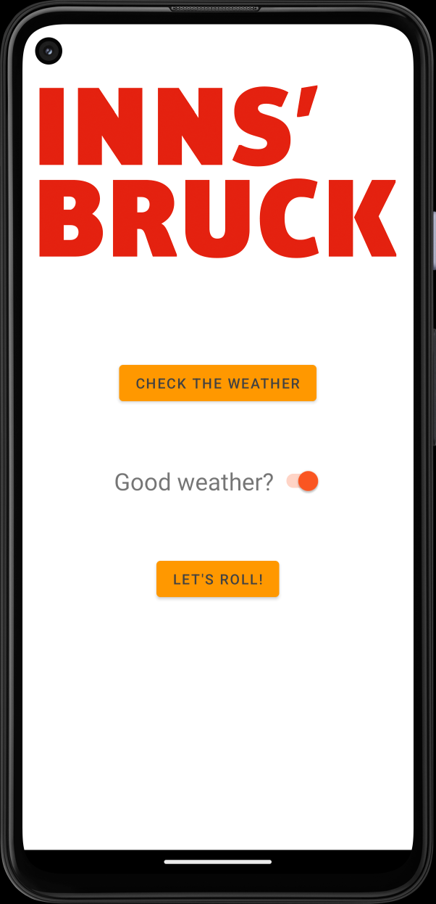

# Overview
{: .reading}

* This will become a table of contents (this text will be scrapped).
{:toc}

# Workshop: Asynchronous Task
{: .reading}




In this session, we will improve the already known IbkActivityPlanner application a little bit by implementing asynchronous execution of a background task and adapting the UI accordingly.

## Revisit the Last State

Open the application by using your implementation or download the state after the last lesson from Sakai.
Choose an appropriate name and save it to a local directory or repository.

Have a look at the files again.
What activities are used and what are they doing?

Especially important for this lesson is the code in `ShowActivity.java` as we want to improve the process of finding and showing the right activity to be done in Innsbruck this weekend :)

## Asynchronous Execution

As you have seen in the lecture, the execution of longer tasks on the *Main-Thread* (which is also the *UI-Thread* in Android) is problematic and therefore we need multitasking by using multiple *threads*.

>If you are not sure what is meant by asynchronous and synchronous execution of the difference between threads and processes, have a look at the slides from this week\'s lecture. You can find them in the resources on Sakai.

From the probably incomplete list presented in the lecture, we will have a closer look at two possibilities of asynchronous execution in android:
- An *Executor* and
- The *AsyncTask* class.

### Executor

The executor class provided by Android is an interface which allows working with *Runnables* flexibly. It removes the need to manually invoke new Threads in the classic Java way but most importantly allows to easily use Runnables for your tasks to be used with more powerful classes like the *ExecutorService*.
>Runnables are basically program blocks which qualify to run in their own thread. For more information have a look [here](https://developer.android.com/reference/java/lang/Runnable){:target="_blank"}.

Let\'s have a look at a minimum example of how to use the Executor with a custom Runnable and the ExecutorService. Imagine a Game-Loop with a fixed refresh rate which needs some sensor data from an IMU to be evaluated (because that\'s what it was). Evaluating the sensor data should be done asynchronously as it takes some time. Also, it is hard to synchronize it with the game loop. The sensor data is sent asynchronously anyways, but a small Runnable is created to be run by the executor to perform the evaluation to find the pose of the IMU.

First, we need a global *ExecutorService* to be used in all the activities of our application. Therefore, we create it as a `static` attribute of our MainActivity class.

````Java
static ExecutorService executorService = Executors.newFixedThreadPool(4);
````
Here we specify the number of threads which will be available. As the size is fixed, the threads exist until the service is shutdown.
>shutdown() will shutdown the service regardless if threads are finished. Have a look at awaitTermination if you need them to be finished.

Now we switch to the class our asynchronous task should run in (in case it is not `MainActivity.java`). Here, we first create variables for our Runnable to be run in background and an executor.
````Java
private Runnable runCheckPose;
private Executor executor;
````
In the e.g. the onCreate() method, the executor of the class gets the global executorService by:
````Java
this.executor = MainActivity.executorService;
````

The Runnable itself is created by implementing the abstract method *run()* on the fly either with
````Java
runCheckPose = new Runnable() {
	@Override
		public void run() {
			// Put code to be run here //
		}
};
````
or by using a lambda expression, as it is the only method of the class anyways.

````Java
runCheckPose = () -> {
	// Put code to be run here
};
````

After the *run()* method has been implemented, the executor can run it anytime you specify by calling:
````Java
executor.execute(runCheckPose);
````

>The Kleingedruckte: this is a minimum example. If you implement this in one of your applications make sure you use your resources appropriately by shutting down non-used services etc.. In any case having a look at the [documentation](https://developer.android.com/reference/java/util/concurrent/ExecutorService#submit(java.util.concurrent.Callable%3CT%3E)){:target="_blank"}. is a good idea.

### AsyncTask

The AsyncTask class is using built in lifecycle-methods to simplify its use. We have four methods to our use:
- doInBackground() -> We **must** override this method as it specifies the tasks to be done in a background thread.
- onPreExecute() -> Is called **before** doInBackground() is called and executes it\'s code on the UI thread.
- onPostExecute() -> Is called **after** doInBackground() is finished and executes it\'s code on the UI thread.
- inProgressUpdate() -> Is called if doInBackground() calls *publishProgress()* and executes it\'s code on the UI thread.

We will use this class in the following section to improve the IbkActivityPlanner application.

## Implementing AsyncTask

>If you are curious you can use Thread.sleep() in your onCreate() method and see what happens if you put in 2000 ms or even 6000 ms before we implement the while loop asynchronously.

In the `ShowActivity.java` we create a nested class inside *ShowActivity*. If you use codecompletion the doInBackground() method should be created for you. Inside the <> we will specify what the doInBackgound, onProgressUpdate() and onPostExecution() accept as parameters (in this order). As we are using the currentWeather boolean variable to find the fitting activity in doInBackground, no progress update and return currentActivity of class IbkActivity we state:
````Java
private class AsyncActivityClass extends AsyncTask<Boolean, Void, IbkActivity> {
        @Override
        protected IbkActivity doInBackground(Boolean... booleans) {
            return null;
        }
}
`````
>Boolean is capitalized as the template does not accept primitive types. Therefore the *Boolean* wrapper class is used which creates an object with a field of type boolean and some helper methods.

You can now try to move the while loop from the onCreate() method to the doInBackground() method and adapt it accordingly. To run the task, create a new instance of the class and directly call the execute() method at the end of the onCreate() method. Do not forget to provide the currentWeather variable.
````Java
new AsyncActivityClass().execute(currentWeather);
````

>If it runs you can try to make the effect more visible again by using Thread.sleep().

## Adding a loading screen

Sometimes, we have to wait for a task to be done before we can show it to the user **but** still we want to keep the responsiveness of our app to:
- Show the user that something is happing and it is (probably) intentional and according to plan
- Keep the Android Environment from killing our application because it cannot update the UI-Thread.

One way to do this is to implement a loading screen. As we are in the same situation with our ShowActivity we will have a look at how this is done.

First, we will add a `ProgressBar` to the constraintLayout of the `activity_show.xml`. Find it in the palette, add constraints and a fitting id. It will move by default, if you want to change the behaviour you can have a closer look at it\'s attributes in the designer. Furthermore, add an id to the `scrollView` as we want it only to be visible once the task is done.

Switching back to the `ShowActivity.java` create variables for the progress bar and the scroll view and connect them to the class in the usual fashion.
>Hint: findViewById()

As we want the progress bar to be visible during the task but not after doInBackground() is finished, we will set it to invisible in the onPostExecute() method of our AsyncTask class. The same process but vice versa is done for the scroll view which includes all the other view elements for this activity.
````Java
@Override
protected void onPreExecute() {
	super.onPreExecute();
	scrollV.setVisibility(View.INVISIBLE);
}

protected void onPostExecute(IbkActivity ibkActivity) {
	super.onPostExecute(ibkActivity);
	prgBarLoading.setVisibility(View.INVISIBLE);
	scrollV.setVisibility(View.VISIBLE);
	// rest of the code...
}
````

Before you have a test run of the application you can add a *Thread.sleep()* somewhere inside the doInBackground() to make it more visible. **As noted in the lecture** this is used to intentionally make the process worse, please avoid using it in your applications ;).
