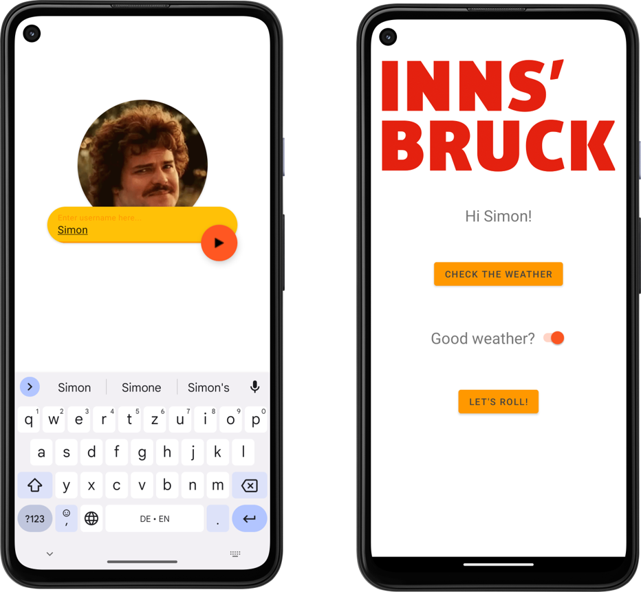

# Overview
{: .reading}

* This will become a table of contents (this text will be scrapped).
{:toc}

# Workshop: Login Screen / Shared Preferences
{: .reading}




In this session, we will add a neat login screen for our IbkActivityPlanner application which gets a username and saves it to the SharedPreferences.

## Get the blank version

Because in the meantime you should have typed `findViewById`\'s and added constraints to UI elements often enough, a kind of template for this workshop is provided for you on Sakai. Make sure to download and unzip it before you start.

### What can you find in the template?
You will see that an additional activity consisiting of `LoginActivity.java` and `activity_login.xml` has been added to the project.
Inside the layout file you can see:
- Two card views which include a `TextInputLayout` and `nothing` (yet) and 
- A floating action button constraint to the input layout.

>Card views can be used neatly as a container to adapt the shape of certain view elements inside. Check out the corners attribute.

In `LoginActivity.java` there is not much going on yet, here we will later add some code to write to the *SharedPreferences* and change activity on button press. Other changes are an additional `TextView` in for the MainActivity to show the username later on.

## Change the launched activity

First thing we are doing is changing the activity which is launched by the system. So far this is the MainActivity. We have to head over to the `manifest.xml` and inside the `<activity>` field of the LoginActivity we add an intent-filter that sepcifies that this is the new Main for this application and the category of system components which can request this action are of type *LAUNCHER*. Furthermore the *exported* attribute has to be set to **true** to allow this activity to be accessed from outside the application. Vice versa is done for the MainActivity, therefore the `manifest.xml` now looks like this:
````XML
... other xml code ...
<activity
	android:name=".LoginActivity"
	android:exported="true">
	<meta-data
		android:name="android.app.lib_name"
	android:value="" />

	<intent-filter>
		<action android:name="android.intent.action.MAIN" />
		<category android:name="android.intent.category.LAUNCHER" />
	</intent-filter>
</activity> 
... other activites...
<activity
	android:name=".MainActivity"
	android:exported="false">
	<meta-data
		android:name="android.app.lib_name"
	android:value="" />
</activity>

... some more code mmmhhhmm ...
````

If we have a testrun we should see the login activity now and are able to switch to the main activity on button press.

## Bonus: Using gifs

Of course we could add a little logo for the application or a avatar picture for the user etc., but if you want you can also add a little gif inside the empty cardview by first adding a external library. This is done by adding (or in your case uncommenting) the line:
````
implementation 'pl.droidsonroids.gif:android-gif-drawable:1.2.22'
````
to the `build.gradle` file which includes *app* at the end of its name.
>Reminder: the gradle files specify how the application is built. That means, libraries, sdk, versions...

Maybe you have to wait until something has downloaded and the gradle has been updated and synced. If you are not sure it synced, do it manually via the elephant icon in the upper right corner of Android Studio and check the *build* logs for any messages.

To add the .gif into our cardview we simply have to add (again uncommenting in your case) following lines to the cardview section in the `activity_login.xml`. The resource file is already added to the project, if you want to use a different file you can add it via the resource manager.

````XML
<androidx.cardview.widget.CardView
... here is some other code ...
	<pl.droidsonroids.gif.GifImageView
	android:layout_width="match_parent"
	android:layout_height="match_parent"
	android:background="#fff"
	android:scaleType="centerCrop"
	android:src="@drawable/nacho_jack_black" />

</androidx.cardview.widget.CardView>
````
Another neat little thing is to move up the UI elements if the keyboard appears on text input. Therefore we simply have to add the *windowSoftInputMode* attribute to the LoginActivity in the `manifest.xml`

````XML
... other code...
<Activity
android:name=".LoginActivity"
android:exported="false">
android:windowSoftInputMode="adjustResize">
... other code ...
````

## Saving the username using SharedPreferences

SharedPreferences are a simple way to store information longer than the applications runtime, i.e. until the information is manually deleted or the application uninstalled. If you want to have an overview again on other options on storing data in Android check the slides from the lecture again or the [documentation](https://developer.android.com/training/data-storage/){:target="_blank"}.

We are using the SharedPreferences to save the specified username even if the application is closed. This wants to be done at the same time as switching to the MainActivity, therefore we add the following lines to the *onClick()* method of the floating action button.

First we get the SharedPreferences from the PreferenceManager of the system and the editor from the SharedPreferences:
````Java
SharedPreferences preferences = PreferenceManager.getDefaultSharedPreferences(LoginActivity.this);
SharedPreferences.Editor editor = preferences.edit();
````
With the editor we can perform multiple actions which are only applied by the time we call the *apply()* method. The value itself is stored as a simple Key-Value pair. After we are finished, the new MainActivity is launched as per usual. Note that the editor.clear() does not clear the SharedPreferences but only makes sure we do not apply any old submissions we do not want to at this point.
````Java
SharedPreferences preferences = PreferenceManager.getDefaultSharedPreferences(LoginActivity.this);
SharedPreferences.Editor editor = preferences.edit();
editor.clear();
editor.putString("User", username);
editor.apply();
````
Having the username in the SharedPreferences now allows us to access it anywhere in the application code and the information is stored savely until removed or uninstall of the application.

**BUT** two usability issues arise in my opinion:
- We do not want to add the username **everytime** we open the application and
- By pressing the back button we do not want to come back to the Login.

The first one is solved by checking if some username is inside the SharedPreferences already and if so launch the MainActivity directly:
````Java
SharedPreferences preferences = PreferenceManager.getDefaultSharedPreferences(LoginActivity.this);
if(preferences.getString("User", null) != null) {
  launchMainActivity();
  }
````
the second one is simply an attribute in the `manifest.xml` again which specifies that this activity should not be part of the navigation history of Android:

````XML
... other code...
<Activity
android:name=".LoginActivity"
android:exported="false">
android:windowSoftInputMode="adjustResize"
android:noHistory="true">
... other code ...
````

At this point we head over to the `MainActivity.java` to get the username and display it in the newly added TextView. In the onCreate() method we call the SharedPreferences again and if a username has been added display it in the TextView.
````Java
SharedPreferences preferences = PreferenceManager.getDefaultSharedPreferences(MainActivity.this);
String userName = preferences.getString("User", null);
if(userName != null) {
	txtUser.setText(String.format("Hi %s!", userName));
} else {
	txtUser.setText("Mr. NeverAddedAUsername");
}
````
>You can see we have to remember the Keys to our Values ourselves. This method can get a bit messy with more complex data.

## Bonus: Change the icon of the application

The icon of the application is easily changed by specifying it in the manifest file. Generally, Android uses a set of files in different resolutions in the .wepb lossless compressed format. As it is not so easy getting those files we can also just use a drawable that we imported into the project by changin the lines in `manifest.xml` to:
````XML
android:roundIcon="@drawable/icons8_mountain_96"
android:Icon="@drawable/icons8_mountain_96"
````


