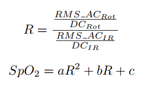

# Overview
{: .reading}

* This will become a table of contents (this text will be scrapped).
{:toc}

# Hintergrund

In der letzten Lesson wurde der Code für den Controller programmiert, um eine Sequenz mit dem poMCI Pulsoximeter aufzunehmen. Da die Sequenz aus den Rohdaten aus Reflexion von infrarot und roter LED besteht, werden wir im nächsten Schritt ein Matlab Skript schreiben, dass:
- Die Daten aus einer Textdatei mit den Rohdaten importiert,
- AC und DC Anteil des Signales voneinander trennt,
- SpO2 und Puls berechnet und
- Die Zwischenschritte und Ergebnisse plottet.

> Es steht euch wie immer frei die Lesson in Python umzusetzen.

# Vorbereitung

Um das Matlab Skript zu schreiben und auszuprobieren, liegt eine Sequenz als `.txt` auf Sakai.

Zu Beginn werden wir uns darum kümmern, dass die Daten im richtigen Format vorliegen und sie dann in Matlab importieren. An sich könnte man die Daten einfach aus dem Serial Monitor der Arduino IDE rauskopieren und in einem Textfile ablegen. In der Arduino IDE 2.0.x dürfte der Serial Monitor hier noch etwas buggy sein, zumindest konnte ich die Daten nicht mit einem Mal rauskopieren. Alternativen gibt es genügend. Schaut euch kurz [Tera Term](http://www.teraterm.org/){:target="_blank"}, [Better Serial Plotter](https://hackaday.io/project/181686-better-serial-plotter/details){:target="_blank"} oder [Processing](https://processing.org/){:target="_blank"} an. Tera Term ist dabei das simpelste Program, richtig eingestellt nicht anders als der Serial Monitor. Better Serial Plotter erlaubt die Daten auch direkt als `.csv` zu exportieren und sie in Real Time zu plotten. Processing ist eigentlich eine Programmierumgebung, um Daten im Allgemeinen zu visualisieren. Die Arduino IDE 1.x liefert auch einen Serial Monitor bei dem rauskopieren immer funktioniert hat. Sucht euch aus, was ihr verwenden wollt, kommt gerne auf mich zu, falls ihr Tipps / Fragen habt. Ihr müsst vielleicht das Format im Arduino Sketch auch etwas anpassen (Better Serial Plotter verlangt z.B. Werte mit Space " " oder Tab "\t" getrennt. In Processing könnt ihr überhaupt ein eigenes Aufnahmescript schreiben, dass die Daten automatisch in ein Textfile schreibt.

**Was ihr verwendet um eure Daten zu kopieren ist egal, jedoch muss eine der Varianten für die Laborsession installiert sein!**


# Implementierung

## Daten Importieren

In der Matlab Einführung habt ihr bereits kennengelernt, wie man Daten in Matlab importiert und daraus sich ein Skript generieren lässt. Gehe dazu in ein Directory, indem deine Daten liegen und indem du arbeiten bzw. dein Skript ausführen möchtest. Via *Import Data* öffnest du dann den Datenimport in Matlab. Wähle dann dein File mit den Daten aus. Es ist der immer selbe Ablauf zu befolgen:
- Wähle erst den *Delimiter* aus, daher den Character der eure Daten trennt. Damit sollten zwei Spalten angezeigt werden.
- Wähle *Collumn Vectors* als Output Type und benenne den ersten als `sens_RED` und den zweiten als `sens_IR`.
- Als Letztes wähle den Pfeil unter *Import Selection* und dann *Generate Function*. Es öffnet sich ein neues Fenster mit einer autogenerierten Function, die mit `Filename` und `dataLines` die Variablen selbst importiert. Diese Function wollen wir abspeichern und später in unserem Skript aufrufen.

Wir erstellen dann ein neues Skript und speichern es erstmal ab. In der ersten Section stellen wir sicher, dass nichts mehr geöffnet ist und keine Variablen mehr im Workspace sind.

````Matlab
clear all
close all
clc
````

Danach rufen wir unsere Function auf und übergeben den Pfad (falls nicht im *Current Folder*) oder Filename (wenn im *Current Folder*) des Files der Daten, die wir verarbeiten möchten. Als `dataLines` übergeben wir `[1 inf]`, da wir alle (2) importieren möchten. Führt ihr den bisherigen Code aus, sollte bis auf `sens_RED` und `sens_IR` mit 1979 Datenpunkten nichts in eurem Workspace aufscheinen.

## Support Variablen

Um die Daten weiterzuverarbeiten, müssen wir erst ein paar Parameter festlegen. Die Samplingrate kennen wir mit 100 Hz. Außerdem wollen wir die ersten 500 Datenpunkte wegwerfen, da die Werte hier oft nicht stimmen. Ebenso wollen wir einen Threshold festlegen mit dem Wert 240000. Werte über dem Threshold sind *zu Hell* und daher Noise durch die Umgebung oder Einfluss auf die Elektronik. Als Letztes brauchen wir noch eine `minProminence`, mit der wir einstellen können, ab wann ein Peak als Peak gilt, um den Puls zu errechnen.

Erstelle damit einen Zeitvektor mit passender Länge und Periode auf Basis der importierten Daten und der Samplingrate und die anderen drei Variablen.

## Trennen von AC und DC

Da wir für die Berechnung von SpO2 lediglich den AC Anteil betrachten, müssen wir erst den pulsierenden Anteil vom Signal trennen. Grundsätzlich, kann man dazu einfach den Mittelwert vom Signal abziehen. Allerdings, kann sich das absolute Level je nach Fingerdruck usw. ändern. Eine Möglichkeit ist daher einen *Moving Average* Filter zu verwenden. Diese besondere Art von FIR Filter gewichtet alle Werte in einem festgelegten Fenster genau gleich. Die Implementierung sieht folgendermaßen aus:

````Matlab
b = (1/windowSize)*ones(1,windowSize); % ones erstellt einen Vektor mit Einsen
a = 1; % Immer bei FIR filtern, kein feedback

signalDC = filter(b,a, signalMitDCundAC);

signalAC = signalMitDCundAC - signalDC;
````

Implementiere den Filter mit einer Fenstergröße von 200 Werten und errechne daraus den AC Anteil der Signale für infrarot und rote Reflexion. Wie wir später sehen werden, brauchen wir zur Berechnung des SpO2 den *RMS* Wert über ein bestimmtes Fenster gemittelt. Wir können dazu denselben Filter verwenden:

````Matlab
RMSDesSignals = sqrt(filter(b,a,signalAC.^2));
````
> Der "." bedeutet, dass Wert für Wert quadriert wird und nicht der Vektor an sich.

Diesen Schritt implementieren wir genauso für infrarot und rotes Signal.

## Discard Samples

Wie oben erwähnt, wollen wir die ersten 500 Datenpunkte loswerden. Führe dazu folgendes für alle bisherigen Signale und den Zeitvektor durch. Hier exemplarisch für den Zeitvektor:

````Matlab
time_d = time(N_disc:end); % Der Doppelpunkt-Operator ist sozusagen ein von-bis
````

Ebenso werden hier die Noise-Werte rausgeworfen, indem wir erst die Werte finden und dann den Wert mit dem vorangegangenem ersetzen. Da dies nur für den Puls relevant ist, reicht das ganze für die Rohdaten, DC und AC Signale für eine der LEDs durchzuführen.

````Matlab
index = find(Signal > threshold);
Signal(index_disc) = Signal(index_disc-1);
````

## Berechnung SpO2

Wir wissen, dass wir SpO2 aus dem Verhältnis von oxygeniertem zu nicht oxygeniertem Hämoglobin.


Da die Absorption der beiden Wellenlängen unterschiedlich davon abhängig ist, kann man aus dem Verhältnis von Rot zu Infrarot auf SpO2 schließen. Für den hier verwendeten Sensor gibt es bereits eine Annäherung mit einem Polynom, basierend auf einer Kalibrierung. Mit:



<!-- $$ R = \frac{\frac{AC_{Rot}}{DC_{Rot}}}{\frac{AC_{IR}}{DC_{IR}}} $$

und 

$$SpO2 = aR^{2} + bR + c$$ -->

Wird dann SpO2 berechnet. Die Werte für die Koeffizienten sind a = 1.59, b = -34.66 und c = 112.69. Hiermit könnt ihr erst R und dann SpO2 berechnen.

> Bei Interesse könnt ihr weitere Details [hier](https://www.analog.com/en/technical-articles/guidelines-for-spo2-measurement--maxim-integrated.html){:target="_blank"} entnehmen.

## Berechnung Puls

Um den Puls zu berechnen, werden im Grunde die Spitzen des infrarot Signals und dessen Zeitabstände gezählt. In Matlab können wir dazu die `findpeaks` Function verwenden. Außerdem übergeben wir den `MinPeakProminence` Parameter, mit dem wir sicherstellen, dass nur die Spitzen gezählt werden, die tatsächlich durch den Herzschlag verursacht wurden. Die Function `diff()` verwenden wir, um die zeitliche Differenz zwischen den Spitzen zu finden. Damit die Vektoren gleich lang bleiben, fügen wir den letzten Wert doppelt ein.

````Matlab
[pk_IR,loc_IR] = findpeaks(signalIR, zeitVektor,'MinPeakProminence', minProminence);
bpm = 60./diff(loc_IR);
bpm(end+1) = bpm(end);
````

# Plotten der Daten

Um die Daten zu plotten, wird euch die Funktion `plotPoMCI` auf Sakai zur Verfügung gestellt. Übergebt die Signale um euch die Ergebnisse plotten zu lassen. Das Ergebnis des letzten Plots sollte dann so aussehen:


# Abgabe
Ladet euer Matlab Skript beim passenden Assignment auf Sakai hoch.
