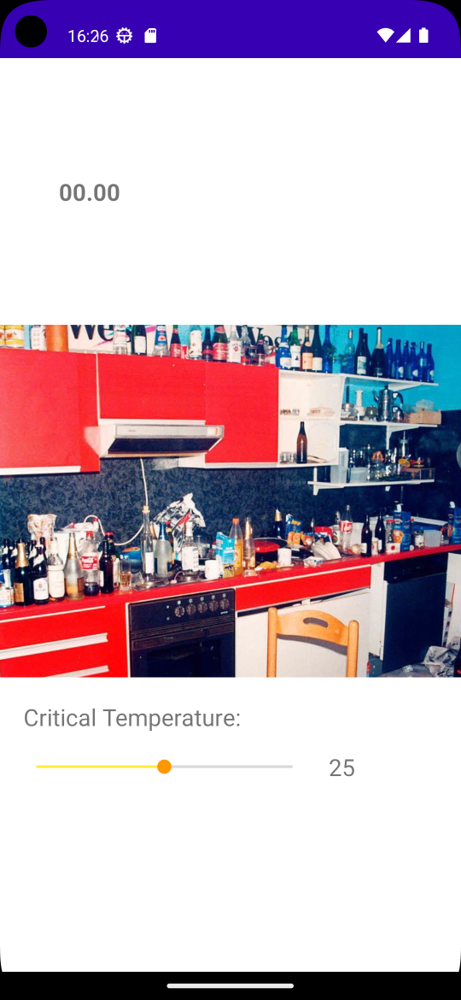

# Overview
{: .reading}

* This will become a table of contents (this text will be scrapped).
{:toc}

# Workshop: MQTT party thermometer
{: .reading}




During this workshop we are going to use MQTT to send basic messanges from an ESP32 to our application running on the phone. We are going to use a wrapper class implemented by Thomas Hausberger to work with the HiveMQ library. The idea is that you are unsure if you will go to this party of your buddy because maybe it\'s lame? Luckily he has an ESP32 running which publishes the current `party temperature` to an MQTT topic.

## Get the blank version

Because in the meantime you should have typed `findViewById`\'s and added constraints to UI elements often enough, a kind of template for this workshop is provided for you on Sakai. Make sure to download and unzip it before you start.

### What can you find in the template?

Besides the usual pair of `MainActivity.java` and `activity_main.xml` you can see that another java directory has been added which contains the wrapper class to work with MQTT. Let\'s have a quick look at the contents:
- In the `MainActvity.java` so far only the UI elements have been connected and some listeners, nothing new for you at this point.
- In `actvity_main.xml` we have some TextViews along with `SeekBar` which will be used to set your critical temperature to go to a party or not.
- The *mqtt* directory has a subdirectory called *data*.
	- The main directory contains the wrapper class.
	- The subdirectory contains a data class which allows us to flexibly change the data which is received via MQTT in the JSON format.

Furthermore, as MQTT requires internet connection, we have to ask for the permission to get it. This has been added to the `manifest.xml` in the activity block of the MainActivity.

## The SimpleMQTTClient

Following the 4 core principles of OOP - you do not have to know or understand the details of what is implemented in this class to use it. Nevertheless, it is good to get a basic understanding of what the class is doing and how it is structured.

Basically, it wraps the most important methods of the HiveMQ libraries classes into the class *SimpleMQTTClient*. Therefore, we only have to use those from the wrapper class. What we can see here and also later on when we are going to implement it is that, a lot of the underlying classes and methods are abstract and therefore have to be overriden and implemented when we are going to use them.

>Remember how actvity lifecycle methods are called and override, the principle is similar.

First thing we have to do, is to create an object of the SimpleMQTTClient in our *onCreate()* method of the `MainActvity.java`. As parameters, the broker, port and a client id is specified.
````Java
client = new SimpleMqttClient("broker.hivemq.com", 1883, UUID.randomUUID().toString());
````


## Implement the wrapper methods

To use the wrapper class in our MainActivity, the class has been imported to the `MainActivity.java` and variables for the *client* created already. As we want to keep our lifecycles as clean as possible, we will create methods which handle the MQTT interaction seperately. First, we are going to connect to the MQTT service. We create the method *connect()* of the `MainActivity` class that returns nothing and has no parameters. Inside the method we call the clients *connect()* method that takes an *MqttConnection* as parameter.
>If you use code completion you can choose which methods you want to override.

````Java
private void connect() {
// establish connection to server (asynchronous)
	client.connect(new SimpleMqttClient.MqttConnection(this) {
	    @Override
	    public void onSuccess() {
		Toast.makeText(MainActivity.this, "Connection successful", Toast.LENGTH_SHORT).show();
	    }

	    @Override
	    public void onError(Throwable error) {
		showError("Unable to connect");
	    }
	});
}
````
The same is done for subscribing to a topic.
````Java
private void subscribe(String topic) {
// subscribe to chatTopic (asynchronous)
	client.subscribe(new SimpleMqttClient.MqttSubscription(this, chatTopic) {
		@Override
		public void onMessage(String topic, String payload) {
			// new message arrived
		}

		@Override
		public void onError(Throwable error) {
		}
	});
}
````
To be able to check for errors also via the UI and not only via logs, we create a little method called *showError()*. It creates a *Toast* which is a little notification like UI element in android which is shown to the user briefly. Create the method that returns nothing and takes *msg* as a parameter.
````Java
Toast.makeText(MainActivity.this, String.format("Unexpected error: %s. Check the log for details", msg), Toast.LENGTH_LONG).show();
````
Use the function in the *onError()* methods of the methods we created above and show messages which make sense for you.

## Prepare the data

As we know, the data to be received is going to be in JSON format, therefore a method is implemented which is deserializing the message and returns it as the *MqttMessage* class that is implemented in *MQTT->data*. It has two fields, "user" and "t", which is pulled from a JSONObject which has been received. If the data in the object is not there, it will throw a *JSONException*.

````Java
private MqttMessage deserializeMessage(String json) throws JSONException{
	JSONObject jMessage = new JSONObject(json);

	String sUser = jMessage.getString("user");
	String sBody = jMessage.getString("t");

	MqttMessage newMsg = new MqttMessage(sUser, sBody);

	return newMsg;
 }
````
## Receive and use messages
The *onMessage()* function of the subscribe method which has been created before is called everytime a message for the specific topic is received. Here, we first want to deserialize the message and then show it to the user via a TextView.
````Java
public void onMessage(String topic, String payload) {
	// new message arrived
	// deserialize JSOn into ChatMessage object
	try {
		MqttMessage msg = deserializeMessage(payload);
		runOnUiThread(new Runnable() {
			@Override
			public void run() {
			String temp = msg.getMessage();
			temp = temp.substring(0, Math.min(temp.length(), 5));
			txtTemp.setText(String.format("Temperature: %s", temp));
			}
		});
	} catch(JSONException je) {
		Log.e("JSON", "Error while deserializing payload", je);
		showError("Invalid chat message received");
	}
}
````
>The *RunOnUiThread()* method is needed because the subscribe function is asynchronous and runs on different thread. For short UI tasks, this is a simple way to be able to adapt UI elements on the spot.

## Start and stop the client

The client should be able to receive messages if the application is visible, choose by yourself which lifecycle methods in the activity you deem appropriate to call the *connect()* and *subscribe()* methods. Make sure that you only connect **if(** the **!client.isConnected())**.

The same is done for disconnecting and unsubscribing. Here you can use the methods from the *client* directly.

## Specify a topic and try it!
To be able to receive messages, make sure you specify the correct topic in the *chatTopic* variable. To test it, either use something similar than an ESP32 as publisher or go to the [HiveMQ broker](http://www.hivemq.com/demos/websocket-client/){:target="_blank"}.


