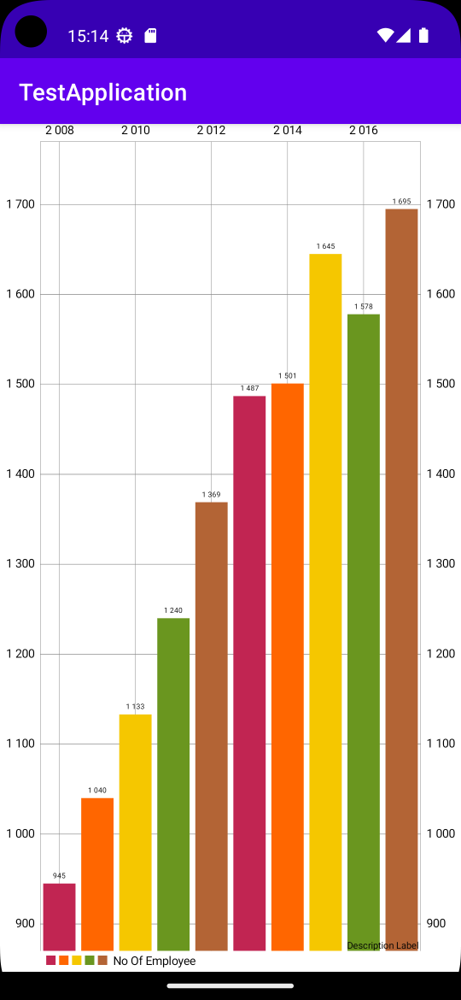
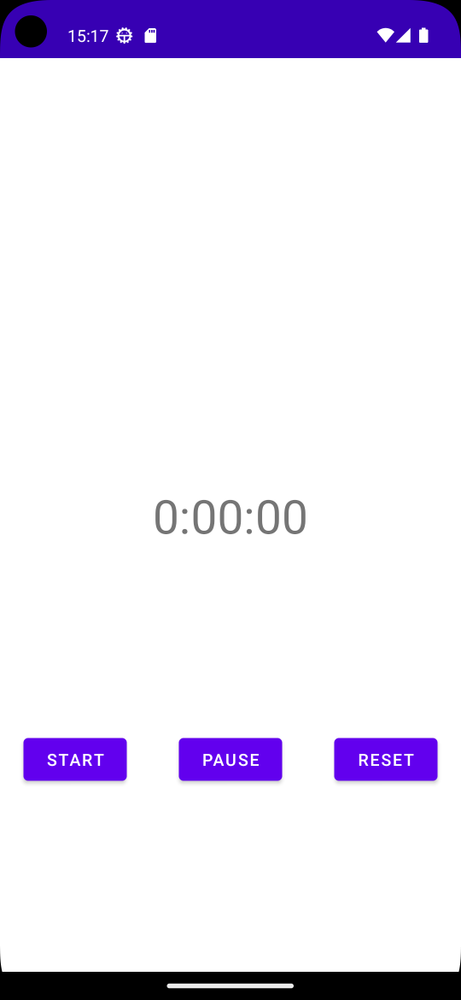
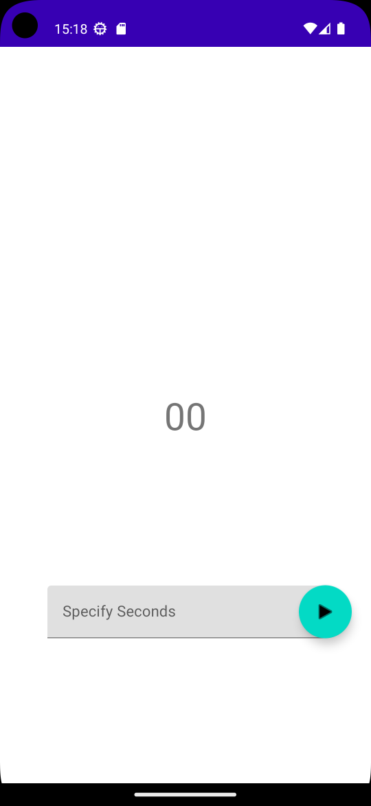
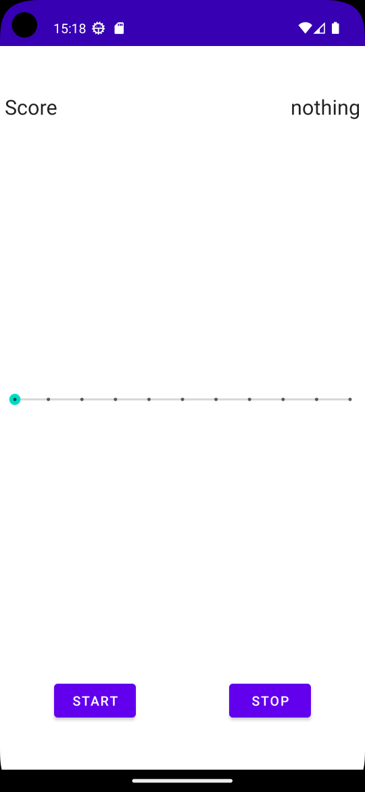

# Overview
{: .reading}

* This will become a table of contents (this text will be scrapped).
{:toc}

# Workshop: Using an external library to show graphs and plots
{: .reading}




In this workshop wea re going to have a quick look on how we use an external library to implement graphs and plots your project.

## Start a new empty project

Make sure you are using the *empty activitiy* template. First thing you can do is to delete the *Hello World* in the layout file.

## The MPAndroidChart Library

In this workshop we are going to use the *MPAndroidChart* library by Philipp Jahoda. It provides a quite complete range of data visualization possibilities. it is implemented natively in Java.
> If you need more information or want to check some example codes, you can find the source and documentation [here](https://github.com/PhilJay/MPAndroidChart){:target="_blank"}.

## Add the library to your project

Simliarily to the MQTT implementation, we need to implement the library to be added to our current project in the gradle files. As the exact steps can differ dependent on the library which wants to be used, we have to check the documentation of the library to see how we have to do it.

In the documentation we can find a *Gradle Setup*:
````
repositories {
    maven { url 'https://jitpack.io' }
}

dependencies {
    implementation 'com.github.PhilJay:MPAndroidChart:v3.1.0'
}
````
> Do not be confused by the *Maven Setup* in the documentation, this is another build tool similarily to *Gradle*. As we use Gradle, it is not relevant for us here.

So, to allow us to work with the library we just have to add the above lines to our *repositories* and *dependencies* block in our gradle files. You can think of the repositories section as some kind of distributor for libraries. *Jitpack* is located at GitHub and holds various libraries as package builds. The block can be found in the `settings.gradle` file. Make sure you add the line in the section which belongs to the dependencies and not plugins.

The second line is found in the `build.gradle` on module level (*Module:YourAppName.app*). It specifies which library of the above repository we want to implement in our project.

After you have finished these steps, sync your gradle files and check in the *Build* section in the lower bar of Android Studio if it has been added successfully.
>The first time syncing maybe takes a bit of time because it has to download the library form said repository.

## Implement some example graph

Now let\'s implement an example. In the layout file of the activity, add a bar chart by adding the following code to your root layout. Adapt the width, height and constraints as you like.

````XML
<com.github.mikephil.charting.charts.BarChart
	android:id="@+id/barchart"
	android:layout_width=""
	android:layout_height="" />
````

In the `MainActivity.java` connect the view element to an instance of class `BarChart` the usual way. Next create an `ArrayList` which should contain the data for the bar chart. Add **some** mock data of type `BarEntry` to the `ArrayList`. The constructor of BarEntry takes two parameters which are simply the x and y values of the chart later on.

````Java
myArrayList.add(new BarEntry(x, y));
````
To be able to show the dataset, the ArrayList has to be converted to a `BarDataSet` and finally to `BarData`. Create a **new** BarDataSet object. Besides the ArrayList it will take a String called *Label* which describes the dataset as a second argument. The constructor for `BarData` takes a the above instantiated BarDataSet as an argument. To show the data in the chart simply call the *setData(myBarData)* method from the BarChart object you created at the beginning.
>You can now try to make the chart more appealing by calling changing e.g. the colors with the *myBarDataSet.setColors()* method or animate the data using *myChart.animateY()*.


# Workshop: Timing in Android

{: .reading}


## Start a new empty project

Make sure you are using the *empty activitiy* template. First thing you can do is to delete the *Hello World* in the layout file.

## Create the application structure

We are going to implement a main screen to navigate to three different timing activities. Therefore, add three more activities to the project, called *PostDelayed*, *CountDownTimer* and *GameLoop* respectively.

For the main screen, create a layout with at least three buttons, and program the `MainActivity.java` so it allows the user to navigate to the other activities by clicking on the corresponding button.

## The timing activities
### Handler
The *Handler* in Android is able to post runnables to a *Looper*. A Looper are lower level classes which handles events. For example if you are using the *MainLooper* you are basically posting it to the main thread of the application. The functionality of the Handler that we want to explore here is to use it to process a certain task at a specific time or repeated period.
> The Handler [documentation](https://developer.android.com/reference/android/os/Handler){:target="_blank"}.

Using the Handlers *postDelayed()* method we are creating a basic stop watch which we can start, stop and reset. Therefore, create three buttons and a text view in the layout file of the post delayed activity you created before. It should look something like this:



In the `PostDelayed.java` file connect the text view and buttons. For the buttons create onClickListeners for each of them. To control the stopwatch and count the seconds, we need two attributes in our PostDelayed class.

````Java
private int seconds = 0;
private boolean running;
````

In the onClick methods of the corresponding buttons the *running* variable should be set to `true` when started and `false` when paused or reset. Additionally, in the onClick method of the reset button, the seconds variable should be set to 0.

Now back to the Handler. Create a method in the PostDelayed class called `runTimer()`. In this method we create a Handler instance by calling it\'s constructor and specifying the Looper we want to use, in our case we want to work on the UI thread and therefore the *MainLooper*:

````Java
Handler handler = new Handler(Looper.getMainLooper());
````

Using the *post()* method we can give the handler runnables. The runnable can be created on the fly, just call method from the *handler* instance and start typing *new Runnable()* as a parameter and Android Studio should create the *run()* method of the Runnable class for you. Here, we specify the code we want to run periodically. In our case, this is simply counting seconds, if the `running` variable is `true` and updating the text view:

````Java
int hours = seconds/3600;
int minutes = (seconds%3600)/60;
int secs = seconds%60;
String time = String.format(Locale.getDefault(), "%d:%02d:%02d", hours, minutes, secs);
txtTime.setText(time);
if (running) {
	seconds++;
}
````
> As the handler is posting to the Main/Ui thread, we do not need runOnUiThread()...

At the end of the runnable we call the handler again to run the same runnable again in 1000 ms using the postDelayed().

````Java
handler.postDelayed(this, 1000);
````

Call the method in the onCreate() method of the PostDelayed class to run the handler. You can build and run the application to try the first timing method using the Handler class.

> Remark: by using a different Looper the handler could also be used to implement asynchronous tasks.

### CountDownTimer

The name of the *CountDownTimer* class of Android is pretty much describing what it can do. By creating an instance you implement two methods of the class:
- onTick(): is called in specified time intervals until the specified time runs out.
- onFinish(): is called if the specified time ran out.
We are going to do exactly what it was made for, a Countdown timer.




Therefore, create a layout file with an input element which allows to set a number in seconds, this can be text input, a seek bar, etc., a button to start the countdown and a text view to show the time which is left. In the `CountDownTimer.java` connect the layout elements to your code in the onCreate() method of the activity class. Create an onClickListener to your starting button. In the *onClick()* method, get the specified seconds of your input element and convert them to milliseconds. The countdown timer is then created by calling the constructor and implementing the above mentioned methods and directly started:

````Java
new android.os.CountDownTimer(milliSeconds, 1000) {
	@Override
	public void onTick(long l) {
		txtTimeLeft.setText(String.format("%d", l/1000));
	}
	@Override
	public void onFinish() {
		txtTimeLeft.setText("Done!");
	}
}.start();
````
The *onTick()* is now called in the specified time interval of 1000 ms, the argument `l` is the time which is left in ms. 
> The whole block is running on the thread that it is called so do not be fooled that this is run asynchroniously, it is simply called periodically and other stuff can run "in between". In this way, the timer is running but the UI stays responsive.

You can build and run the application to try the second timing method using the CountDownTimer class.

### Game Loop
The last timing method is a bit more complex, but allows especially the groups which want to implement a game in their application a neat way to run a game loop. Therefore, the module `rtLoop` which stands for realtime loop. The *FixedRateLoopActivity* then allows us to run code in a loop of fixed rate (suprise).

The Activity `FixedRateLoopActivity` is a subclass of `AppCompatActivity` and provides the functionality to execute a `FixedPeriodLooper`s in the background, i.e. without blocking the UI. It provides methods to control the loop execution:

- loopStart()

- loopStop()

- loopPause()

- loopResume()

- loopReset()

and provides lifecycle methods to react on status changes (e.g. abort on error):

- onLoopCreate()

- onLoopStart()

- onLoopPause()

- onLoopResume()

- onLoopStop()


First of all, the module "rtloop" must be loaded into our program, you can find the .zip file on sakai. This can be done in the menu under

``` menu
File -> New -> Import Module ...
```

>don\'t forget to unpack it 

To use the rtloop library in the main program you have to link it first. Under "Gradle Scripts" there is a file ``build.gradle (Module: app)``. In this file, a line has to be added to "dependencies":

``` menu
implementation project(':rtloop')
```

So in the end the section "dependencies" will look similar to this:

``` menu
dependencies {
    implementation 'androidx.appcompat:appcompat:1.2.0'
    implementation 'com.google.android.material:material:1.2.1'
    implementation 'androidx.constraintlayout:constraintlayout:2.0.4'
    testImplementation 'junit:junit:4.+'
    androidTestImplementation 'androidx.test.ext:junit:1.1.2'
    androidTestImplementation 'androidx.test.espresso:espresso-core:3.3.0'
    implementation project(':rtloop')
}
```

Afterwards the project must be implemented with the menu items

``` menu
Tools -> Android -> Sync Project with Gradle Files
```

and

``` menu
Build -> Make Project (Ctrl + F9)
```

must be recompiled. Now the library can be used in the main program.

Instead of `AppCompatActivity` now `FixedRateLoopActivity` is used as superclass:

``` java
public class MainActivity extends FixedRateLoopActivity { // change from AppCompatActivity

    @Override
    protected void onCreate(Bundle savedInstanceState) {
        super.onCreate(savedInstanceState);
        setContentView(R.layout.activity_main);
    }
}
```
To visualize the behaviour, we simply create a layout file with a *Score* which is incremented with every loop iteration, a seek bar which controls the loop rate and a start / stop button. You can find the .xml code to be pasted into `activity_game_loop.xml` here:



[>Layout Code<](../../assets/source/012_timingAndGraphs/activity_game_loop.xml){:target="_blank"}

In the onCreate() method of the `GameLoop.java` connect the view elements. But before we implement the methods of the UI elements, we first want to implement the methods of the loop itself:

- loopSetup()
	- Called when before starting the loop process. Create a attribute *int score* to the GameLoop class and set it to 0 here. 

- onLoopStart()
	- Called when starting the loop. Set the text of the starting button to \"Pause\" by calling the method `setWidgetText(myButton, "Pause");`. The method is needed, as the loop itself is not running on the main thread, therefore it was implemented to be able to interact with UI elements (similar to runOnUiThread()).

- onLoopPause()
	- Called if the loop is paused. Set the text of the starting button to \"Resume\".

- onLoopResume()
	- Called when the loop is resumed. Set the text of the starting button to \"Pause\".

- onLoopStop()
	- Called when the loop is stopped. Set the text of the starting button to \"Start\".

and last but most importantly, we have to specify what happens when the loop is executed on each iteration by implementing the method:
- loopIteration()
	- It is called in the specifed rate of the loop on every iteration. Simple increment the `score` variable here and call the *setWidgetText()* method to change the number in the score text view.


Now we implement the methods to interact with our UI elements. For the starting button create an onClickListener. The button itself should start and pause the \"game\", therefore a basic state machine is implemented in the onClick() method which checks the current state of the loop:

````Java
LoopState state = getLoopState();
switch(state) {
	case CREATED:
	case STOPPED:
		loopStart(); // start if CREATED or STOPPED
		break;
	case RUNNING:
		loopPause(); // pause if RUNNING
		break;
	case PAUSED:
		loopResume(); // resume if paused
		break;
}
````
In the onClick() method of the stop button, we simply want to stop the loop and call *loopStop();*. To change the loop frequency, implement a OnSeekBarChangedListener in the same manner as you would implement an onClickListener for a button. In the *onProgressChanged()* method which should be generated by Android Studio for you, we add the line below to set the frequency of the loop between 1 and 10 Hz.
````Java
setLoopFrequency(progress);
````
You can build and run the application to try the third timing method using the rtLoop module.


#### Bonus: Snake

If you are curious on how this would be implemented in an actual game, download and unpack the *SnakesOnAPhone* project from sakai. It should run out of the box and is a basic implementation of the game snake which uses the `rtLoop` module.
For all of you who are motivated, try to change the application so that the score is only incremented if the snake *eats* and not by every iteration.


