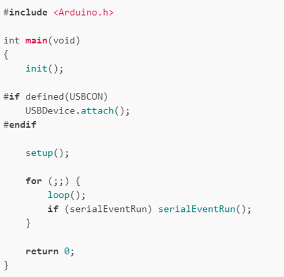

# Overview
{: .reading}

* This will become a table of contents (this text will be scrapped).
{:toc}

# Analysis of the 'Simon Says' Arduino Code

## 1. Introduction

In this first example, we will discuss the code of this [online example](https://wokwi.com/projects/328451800839488084). It is provided by the embedded emulator **WOKWI**, which can be used nicely for practising and testing code for different controllers and frameworks. In the best case you can try the code first, see what it does and then you can go through it using the lesson side by side. If you have never read any C++, please have a look at the appendix, otherwise you can skip it. **However, make sure you follow the section on installing the Arduino IDE!**

> Of course we could start by a "please write code to make a LED blink", but even if generative AI or simply googling example code is really helpful for programming this would mean skipping the basics. Something that will trip you up later. Would not recommend.

The "Simon Says" example is not only chosen because of the great name, but is actually close to a real project which is currently undergoing a study at the psychology department of the university clinic Innsbruck. The device shown below is used with patients with cognitive decline and compared to standardized tests in order to better understand the disease(s). In the device the same logic of remembering a sequence is paired with buttons, RGB LEDs and vibrative feedback. All powered by embedded systems, i.e. an ESP32. 


## 2. Overall Code Structure

An Arduino program, or "sketch," follows a standard structure that is easy to read and understand. The Simon Says code is a clear example of this structure, organizing its logic into distinct sections that are processed in a specific order by the compiler and microcontroller.

### Preprocessor Directives and Includes

At the very top of the file, you find preprocessor directives. These are instructions that are processed before the main program is compiled.
*   `#include "pitches.h"`: This line includes an external file named `pitches.h`. This file likely contains predefined constants for musical note frequencies, making the code more readable than using raw numbers for the `tone()` function.
*   `#define SPEAKER_PIN 8`: This is a macro definition that tells the compiler to replace every instance of `SPEAKER_PIN` with the number `8` before compilation. This is used for defining constant values that will not change.

### Global Variables and Constants

Following the preprocessor directives is the declaration of **global variables and constants**. These are accessible from anywhere in the program.
*   **Constants**: Values that do not change, declared with the `const` keyword. In this code, `const` is used for pin assignments (`ledPins`, `buttonPins`, `LATCH_PIN`) and game parameters (`gameTones`, `MAX_GAME_LENGTH`). Using named constants makes the code easier to understand and modify.
*   **Global Variables**: These store the state of the game and can be changed by any function. `gameSequence[]` is an array that stores the random sequence of colors, and `gameIndex` tracks the player's current level. These must be global so that multiple functions can access and modify the game's state.

### The `setup()` Function

The `void setup()` function is a required part of every Arduino sketch. It runs only once when the Arduino is powered on or reset. Its purpose is to initialize settings and prepare the hardware. 

### The `loop()` Function

After `setup()` finishes, the `void loop()` function runs continuously. This is the core of the program where the main game logic resides. 

### Custom Functions

The majority of the program's logic is encapsulated in **custom functions** written by the programmer. This practice makes the code modular, easier to debug, and simplifies the main `loop()`.


## 3. Core Structure and Hardware Interfacing

The Simon Says code is a well-structured Arduino program, or "sketch," that follows the platform's fundamental programming model. It consists of two primary functions required by every Arduino program: `setup()` and `loop()`.

### The `setup()` Function

The `setup()` function runs only once when the Arduino is first powered on or reset. Someone might be saying "BUT THE START OF EVERY C++ PROGRAMM NEEDS TO BE A MAIN" and would be correct! In the background the Arduino sketch looks like this. Only we as developers see a version one level higher.



In the code, the setup function is responsible for initializing the hardware resources and software components needed for the game:
*   **Pin Configuration**: It uses a `for` loop to iterate through arrays containing the pin numbers for the LEDs and buttons, setting their `pinMode()` to either `OUTPUT` for the LEDs or `INPUT_PULLUP` for the buttons. Setting a pin as an `OUTPUT` allows the Arduino to send 5V to components like LEDs, effectively acting as a switch. Setting a pin as an `INPUT` allows it to read the state of components like switches. The use of `INPUT_PULLUP` activates an internal pull-up resistor, which makes the pin read `HIGH` by default and `LOW` only when a button connects it to ground. The use of a `for` loop to efficiently configure multiple pins is a common programming practice also seen in other projects.
*   **Serial Communication**: `Serial.begin(9600)` opens a serial communication channel between the Arduino and a computer at a speed of 9600 bits per second (baud). This allows the program to send information, such as the final score, to the serial monitor for debugging or display purposes.
*   **Randomization**: The line `randomSeed(analogRead(A3))` is crucial for generating a random sequence for each game. It initializes the pseudo-random number generator with a value read from an unconnected analog pin, which provides a noisy and unpredictable starting point for the `random()` function.

### The `loop()` Function

After `setup()` completes, the `loop()` function runs continuously. This is where the main logic of the game resides. The code in `loop()` calls a series of custom functions that manage the game's progression: adding a new step to the sequence, playing it for the user, checking the user's input, and handling success or failure.

### Interfacing with Hardware

The game interacts with the physical world through sensors and actuators.
*   **LEDs (Actuators)**: The LEDs are controlled using `digitalWrite(pin, HIGH)` to turn them on and `digitalWrite(pin, LOW)` to turn them off. The Arduino digital pins can output 5V (`HIGH`) or 0V (`LOW`).
*   **Buttons (Sensors)**: The state of the pushbuttons is read using `digitalRead(pin)`. This function checks if there is voltage on the specified input pin. The code checks for a `LOW` signal because the pins are configured with an internal pull-up resistor (`INPUT_PULLUP`), which means they read `HIGH` by default and `LOW` when the button is pressed to connect the pin to ground.
*   **Speaker (Actuator)**: Sound is generated using the `tone()` and `noTone()` functions. The `tone()` function generates a square wave of a specified frequency on a pin, causing the piezo element to vibrate and create sound. The frequencies for the notes are pre-defined in an array, similar to the method used in the Keyboard Instrument project.

## 4. Data Management and Program Logic

The game's state and logic are managed through variables, arrays, and control structures like `if` statements and `for` loops.

### Variables and Arrays

*   **Variables** are used to store values that can change, such as the current length of the game sequence in `gameIndex`.
*   **Arrays** are used to group related values, which makes the code more organized and efficient. The code makes extensive use of arrays:
    *   `ledPins[]` and `buttonPins[]` store the pin numbers for the hardware components.
    *   `gameTones[]` stores the musical frequencies for each color.
    *   `gameSequence[]` is a crucial array that stores the randomly generated sequence of colors the player must follow.

### Game Flow and Control Structures

The game's logic is built upon fundamental programming concepts demonstrated in the Arduino Projects Book.
*   **Random Sequence Generation**: In the `loop()`, `random(0, 4)` generates a new number from 0 to 3, which is then added to the `gameSequence` array.
*   **Conditional Logic**: The `checkUserSequence()` function uses a `for` loop to iterate through the sequence and an `if` statement to compare the expected button press (`expectedButton`) with the one the user actually pressed (`actualButton`). If they do not match, the function returns `false`, leading to a "game over" state.
*   **State Machine Concept**: Although not explicitly coded as one, the game's overall structure can be understood as a **finite state machine**, a concept from embedded systems theory. The program moves between distinct states: "playing sequence," "awaiting user input," "level up," and "game over". The flow is deterministic; for example, from the "awaiting user input" state, a correct sequence leads to "level up," while an incorrect input leads to "game over".

## 5. Code Modularity and Advanced Topics

The code is well-organized into custom functions, which makes it easier to read, debug, and reuse code blocks. Functions like `playSequence()`, `readButtons()`, `checkUserSequence()`, and `gameOver()` encapsulate specific parts of the game's functionality.

### 7-Segment Display and Data Representation

A notable feature of this code is the use of a 74HC595 shift register to control a 7-segment display for the score.

Of course. Here is the additional section describing the overall structure of the code, integrated into the beginning of the previous markdown text.


*   `gameOver()` and `playLevelUpSound()`: Provide feedback to the player after a round is completed.

## 6. Next Steps: Üben Üben Üben or Practice Makes Perfect

Of course I urge you to write your own code and practice. There are so many basic tutorial found in the internet that I don't have to repeat this here. In the synchronous sessions we will of course start very basic too, but you can get a headstart if you already try some stuff with WOKWI as we cannot cover everything within the time!

# Setting up the Arduino IDE

For the synchronous sessions, make sure you set up the Arduino IDE on your laptop. The manual and program download can be found [here](https://docs.arduino.cc/software/ide-v2/tutorials/getting-started/ide-v2-downloading-and-installing/). After installing, you can try if everything worked by **verifying** i.e. pressing the checkmark button on some example code. For this step you need to choose a certain controller in the boards manager. For simplicity you can just choose the "Blink" example (File->Examples->Basics->Blink) and verify it for the Arduino UNO (on the top it should state the board). If this works for you, you are ready for the synchronous lectures!

> In Arduino **verifying** is basically compiling and **uploading** programming i.e. flashing the controller. The second is the process of actually putting the code onto the hardware, while the first one is only creating the code to be run by the MCU without actually needing the hardware present.

# Appendix: C++ Variables, Functions, and Data Types

## Variables in C++

A **variable** is a named storage location in memory that holds a value.  
To use a variable in C++, you must **declare** it first with a type.

### Syntax
```cpp
type variableName = value; // optional initialization
// Examples
int age = 25;
float temperature = 36.6;
char grade = 'A';
bool isOn = true;
```

### Key Points

* The **type** tells the compiler what kind of data the variable holds.
* Variable names should be descriptive and follow C++ naming rules.
* You can declare multiple variables of the same type:

  ```cpp
  int x = 5, y = 10, z = 15;
  ```

---

## Functions in C++

A **function** is a block of code that performs a specific task.
It helps organize code, reuse logic, and make programs easier to maintain.

### Syntax

```cpp
return_type functionName(parameters) {
    // function body
    return value; // only if return_type is not void
}
```

### Example

```cpp
int add(int a, int b) {
    return a + b;
}

void greet() {
    std::cout << "Hello!" << std::endl;
}
```

### Key Points

* **return\_type**: The data type of the value the function returns (or `void` if nothing is returned).
* **parameters**: Optional inputs to the function.
* **return statement**: Ends the function and returns a value.

### Using Functions

```cpp
int main() {
    int sum = add(5, 3);
    greet();
    return 0;
}
```

---

## Data Types in C++

C++ supports several built-in data types:

| Type     | Description                     | Example                          |
| -------- | ------------------------------- | -------------------------------- |
| `int`    | Integer numbers                 | `int count = 42;`                |
| `float`  | Single-precision floating point | `float pi = 3.14f;`              |
| `double` | Double-precision floating point | `double e = 2.718;`              |
| `char`   | Single character                | `char grade = 'A';`              |
| `bool`   | Boolean (true/false)            | `bool isReady = true;`           |
| `void`   | No type / no return             | Used in functions with no return |

You can also use **modifiers** such as `signed`, `unsigned`, `short`, and `long` to adjust the storage size or sign of integer types:

```cpp
unsigned int score = 100;
long population = 7800000000;
```


